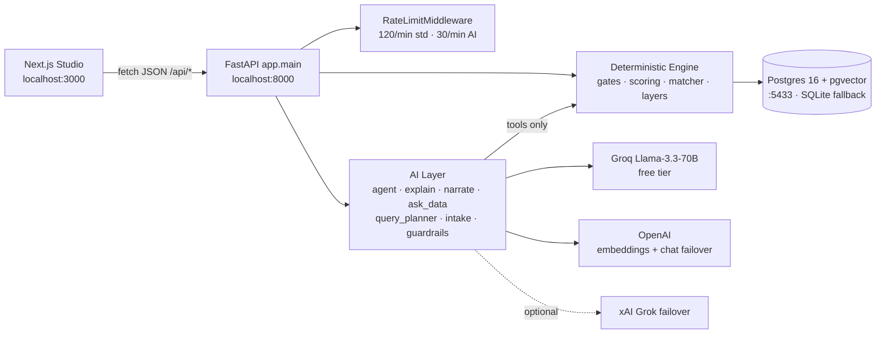
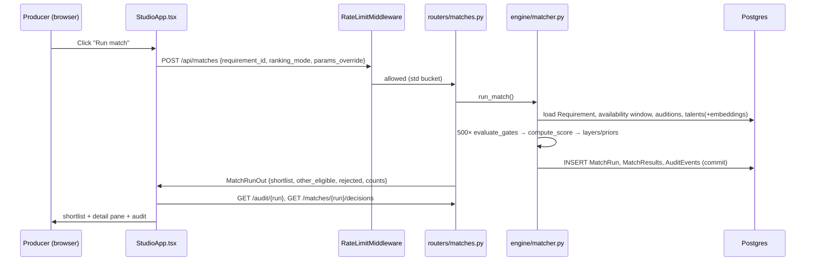
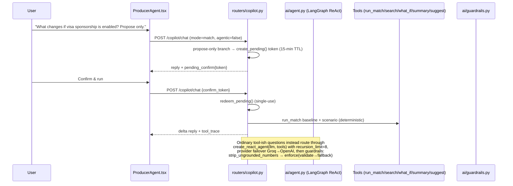

# OLC Live — Talent Operations Platform: Complete Reverse-Engineering & Client Presentation Document

> **Positioning note:** the repo brands itself "OLC Talent Matching", but the product is a full **talent operations platform** with six pillars — **Intake → Match → Decide → Book → Report → Source** — plus a governed AI layer across all of them. Matching is one pillar. Part II of this document gives every other module the same depth as the matching engine.

**Prepared:** 20 July 2026
**Source of truth:** the `olc-live` repository (every claim below is verified against actual source files, cited inline).
**Honesty convention used throughout:** every capability is tagged **[Implemented]**, **[Partially Implemented]**, or **[Proposed]** (i.e., not in code). Nothing is assumed.

---

## Table of Contents

1. [Phase 1 — Project Understanding (Repository Map)](#phase-1)
2. [Phase 2 — Executive Summary](#phase-2)
3. [Phase 3 — Project Objectives](#phase-3)
4. [Phase 4 — Complete Feature Inventory](#phase-4)
5. [Phase 5 — Complete Application Walkthrough (Screen by Screen)](#phase-5)
6. [Phase 6 — Button-Level Analysis](#phase-6)
7. [Phase 7 — Complete User Journeys](#phase-7)
8. [Phase 8 — Complete System Workflow (with Mermaid diagrams)](#phase-8)
9. [Phase 9 — API Documentation (every endpoint)](#phase-9)
10. [Phase 10 — Database Analysis](#phase-10)
11. [Phase 11 — AI / ML Modules](#phase-11)
12. [Phase 12 — Security](#phase-12)
13. [Phase 13 — Deployment](#phase-13)
14. [Phase 14 — Current Implementation Status](#phase-14)
15. [Phase 15 — Proposed Production Features (PM Roadmap)](#phase-15)
16. [Phase 16 — OLC Live Value (Most Important)](#phase-16)
17. [Phase 17 — Client Demo Script](#phase-17)
18. [Phase 18 — Client Q&A (100 Questions)](#phase-18)
19. [Phase 19 — Final Deliverable Summary, Risks, Recommendations](#phase-19)
20. [**PART II — Module Deep Dives (equal depth for every module)**](#part-2)
    - [D1. Reporting & Profiling Suite (all 12 reports, individually)](#d1)
    - [D2. Requirement Intake (brief → requirement)](#d2)
    - [D3. Natural-Language Talent Search](#d3)
    - [D4. What-If Scenario Lab](#d4)
    - [D5. Co-Pilot (Conversational Agent)](#d5)
    - [D6. Decisions, Bookings & Call Sheets](#d6)
    - [D7. StageLync Sourcing Connector](#d7)
    - [D8. Pool Analytics & AI Cost Observability](#d8)
    - [D9. Marketing Draft Studio](#d9)
    - [D10. Export & Document Engine](#d10)

---

<a id="phase-1"></a>
# PHASE 1 — PROJECT UNDERSTANDING (Repository Map)

## 1.1 What this application is

**OLC Talent Matching** is an *explainable casting/talent-matching platform for live entertainment productions* (circus-style spectacles, arena shows, fireworks parades, vocal ensembles — the Gulf-region live-events market is the demo focus: Abu Dhabi, Dubai, Jeddah).

Core design philosophy (stated in `README.md` and enforced in code):

> "OLC shortlists talent the way a careful producer would — with hard gates, a transparent score, and an audit trail — then uses AI only to *orchestrate and explain* those results. **Scores are never invented.**"

It is a **closed demonstration environment / POC**: authentication is deliberately deferred, data is 100% synthetic, and it is intended to run on localhost only (`app/main.py` description string: *"Closed demo — Auth deferred; do not host publicly."*).

## 1.2 Technology stack (verified)

| Layer | Technology | Source |
|---|---|---|
| Frontend | Next.js 15 (App Router, Turbopack), React 19, TypeScript 5, Tailwind CSS 3.4, Recharts 3 (charts), react-leaflet/Leaflet (map) | `frontend/package.json` |
| Backend | FastAPI 0.115.6, Uvicorn, SQLAlchemy 2.0, Pydantic 2, Starlette | `backend/requirements.txt` |
| Database | PostgreSQL 16 + pgvector (Docker), SQLite fallback for tests/offline | `docker-compose.yml`, `app/database.py` |
| AI orchestration | LangGraph 0.2.76 (`create_react_agent`), langchain-openai | `requirements.txt`, `app/ai/agent.py` |
| LLM providers | Groq Llama-3.3-70B-Versatile (default, free tier), OpenAI gpt-4o-mini (failover), optional xAI Grok | `app/config.py`, `app/ai/providers.py` |
| Embeddings | OpenAI `text-embedding-3-small` (1536-dim), stored in pgvector | `app/config.py`, `app/embeddings.py` |
| Documents/exports | ReportLab (PDF), openpyxl (Excel), csv/json | `app/routers/export.py`, `app/routers/reports.py` |
| Migrations | Alembic (baseline only, optional) | `backend/alembic/` |
| Tests | pytest (backend, isolated SQLite), Node `tsx --test` (frontend unit), Playwright (E2E) | `backend/tests/`, `frontend/playwright.config.ts` |
| CI | GitHub Actions: backend pytest + pip-audit, frontend tsc/lint/unit/build + npm audit, Playwright demo-path E2E on SQLite | `.github/workflows/ci.yml` |

## 1.3 Repository layout (complete)

```
olc-live/
├── README.md                        # Product overview, quick start, demo path
├── docker-compose.yml               # pgvector/pgvector:pg16 on 127.0.0.1:5433
├── OLC_Talent_Matching_Features.xlsx# Feature contract (F01–F20)
├── .github/workflows/ci.yml         # 3 CI jobs: backend / frontend / e2e
├── docs/
│   ├── DEMO_SCRIPT.md               # Beat-by-beat client demo script
│   ├── FEATURE_AUDIT_F01_F20.md     # Honest readiness audit of F01–F20
│   ├── REMAINING_BUILD_PLAN.md      # Outstanding work plan
│   └── AI_AUGMENTED_BLUEPRINT.md    # AI architecture blueprint
├── data/                            # Synthetic seed dataset (CSV/JSON)
│   ├── talent_profiles.csv          # 500 talent profiles
│   ├── production_requirements.csv  # 120 requirements
│   ├── talent_availability.csv      # ~120k day-level rows
│   ├── audition_evaluations.csv     # ~3,350 audition rows
│   ├── production_credits.csv       # 1,500 credits
│   ├── match_ground_truth.csv       # Reference labels the engine must reproduce
│   ├── edge_case_manifest.csv       # Deterministic edge scenarios
│   ├── stagelync_people.json        # StageLync connector fixture
│   ├── data_dictionary.csv
│   ├── faq/*.md (+ .faq_embeddings.json)  # 13 Help/FAQ docs + embedding cache
│   └── legacy_toy_seed/…            # Earlier toy dataset
├── scripts/                         # live_smoke.sh, reseed.sh, prebuild_faq_index.py
├── backend/
│   ├── requirements.txt, .env.example, alembic/, olc.db (SQLite artifact)
│   ├── tests/ (17 test modules)
│   └── app/
│       ├── main.py                  # FastAPI entrypoint, router registration
│       ├── config.py                # Pydantic Settings (env-driven)
│       ├── database.py              # Engine/session, pgvector extension, indexes
│       ├── models.py                # 13 SQLAlchemy models
│       ├── schemas.py               # Pydantic request/response schemas
│       ├── seed.py                  # CSV → DB seeding + embedding build
│       ├── embeddings.py            # Embedding facade + talent_document()
│       ├── countries.py             # Country/city normalization + aliases
│       ├── rate_limit.py            # In-process per-IP rate limiting middleware
│       ├── engine/                  # DETERMINISTIC MATCHING CORE
│       │   ├── gates.py             # 12 hard gates + eligibility facts
│       │   ├── scoring.py           # 10-factor weighted score (0–100)
│       │   ├── matcher.py           # run_match orchestrator + audit trail
│       │   ├── layers.py            # Gate graph, near-miss, 4-layer scoring, confidence
│       │   ├── feedback.py          # Hybrid ranking feedback prior
│       │   └── badges.py            # Budget/travel/safety badge derivation
│       ├── ai/                      # AI LAYER (orchestrate + narrate only)
│       │   ├── providers.py         # Groq/OpenAI/xAI chat routing, cache, cost log
│       │   ├── guardrails.py        # Output validation (numbers, bias, contradictions)
│       │   ├── agent.py             # LangGraph ReAct Co-Pilot with 5 tools
│       │   ├── explain.py           # Grounded match explanations
│       │   ├── narrate.py           # Executive/pool narratives
│       │   ├── ask_data.py          # 14-template Reporting Agent (NL Q&A)
│       │   ├── query_planner.py     # NL search → structured filter plan
│       │   ├── intake.py            # Casting-brief extraction (vocab-grounded)
│       │   ├── retrieval.py         # BM25 + vector + RRF hybrid ranking
│       │   ├── rerank.py            # Advisory ML re-ranker
│       │   ├── faq_index.py         # FAQ RAG index with disk cache
│       │   ├── chat_sessions.py     # In-memory Co-Pilot sessions (2h TTL)
│       │   ├── pending_actions.py   # Confirm-token store for mutating what-ifs
│       │   └── predictors/          # Local heuristic ML signals (no API cost)
│       └── routers/                 # 16 API routers (detailed in Phase 9)
│           ├── catalog.py  matches.py  search.py  whatif.py  audit.py
│           ├── analytics.py  reports.py  ops_reports.py  copilot.py
│           ├── jobs.py  bookings.py  marketing.py  stagelync.py
│           ├── export.py  edges.py  ai_costs.py
└── frontend/
    ├── package.json, tailwind.config.ts, next.config.ts, playwright.config.ts
    └── src/
        ├── app/ (layout.tsx, page.tsx, globals.css, design-system/page.tsx)
        ├── lib/ (api.ts ≈60 API wrappers, types.ts, features.ts flags,
        │        candidateBadges.ts, agentSession.ts, cn.ts)
        └── components/
            ├── StudioApp.tsx        # App shell: nav, global state, all actions
            ├── views/ (MatchView, SearchView, WhatIfView, ReportsView,
            │           MoreView, EmptyState)
            ├── OverviewPanel, ShortlistPanel(+TalentDetailPane), RejectedList,
            │   ProducerAgent (Co-Pilot chat), NewRequestPanel, AskDataPanel,
            │   SupplyDemandPanel, ProductionReadinessPanel,
            │   SafetyCompliancePanel, BudgetReliabilityPanel, ComparePanel,
            │   CandidateBadges, AvailabilityStrip, CreditsPanel,
            │   ScoreVisuals (bars + radar), TalentMap, CopilotPanel
            └── ui/ (Button, Card, Tabs, Field, Table, Badge, Score, Stat,
                     Section, Brand — design-system primitives)
```

## 1.4 Environment variables (complete, from `backend/.env.example` + `config.py` + `features.ts`)

**Backend:**

| Variable | Purpose | Default |
|---|---|---|
| `DATABASE_URL` | Postgres+pgvector DSN; SQLite fallback if unset | `sqlite:///backend/olc.db` |
| `OPENAI_API_KEY` | Embeddings (required for NL search / StageLync semantic / FAQ RAG); optional chat failover | none |
| `GROQ_API_KEY` | All chat (explain, Co-Pilot, LangGraph agent, jobs parsing, narratives) | none |
| `XAI_API_KEY` / `GROK_API_KEY` | Optional extra chat failover (Grok) | none |
| `AI_CHEAP_PROVIDER` / `AI_QUALITY_PROVIDER` | Provider routing per tier (`groq`\|`openai`\|`xai`) | `groq` / `groq` |
| `AI_FALLBACK` | Enable provider failover chain | `true` |
| `SKIP_EMBEDDINGS` | Skip embedding build on seed (offline mode) | `0` |
| `FORCE_RESEED` | Force reseed after CSV edits | — |
| Model config | `openai_embedding_model=text-embedding-3-small`, `openai_chat_model=gpt-4o-mini`, `groq_chat_model=llama-3.3-70b-versatile`, `xai_chat_model=grok-4.3`, `embedding_dim=1536` | `config.py` |

**Frontend (`src/lib/features.ts` + `api.ts`):**

| Variable | Purpose | Default |
|---|---|---|
| `NEXT_PUBLIC_API_BASE` | Backend URL | `http://127.0.0.1:8000/api` |
| `NEXT_PUBLIC_FEATURE_EDGES` | Show Edges tab (raw/dev) | off |
| `NEXT_PUBLIC_FEATURE_MARKETING` | Show Marketing tab | off |
| `NEXT_PUBLIC_FEATURE_DESIGN_SYSTEM` | /design-system page | off |
| `NEXT_PUBLIC_FEATURE_AI_COSTS` | AI cost widget | off |
| `NEXT_PUBLIC_FEATURE_STAGELYNC` | StageLync tab | **on** (opt-out with `0`) |
| `NEXT_PUBLIC_FEATURE_BOOKINGS` / `_POOL` / `_AUDIT` / `_COMPARE` | Operations sub-tabs | **on** |

## 1.5 There is NO authentication, login screen, or user model — verified

`app/main.py` registers only CORS (allow-all) and `RateLimitMiddleware`. There are no auth routes, no user table in `models.py`, no JWT code anywhere in the repo. The README explicitly defers auth ("Closed demonstration environment. Authentication is deferred."). **Any walkthrough therefore starts at the Studio Overview screen, not a login page.** This is a deliberate, documented scope decision — not an oversight.

---

<a id="phase-2"></a>
# PHASE 2 — EXECUTIVE SUMMARY

## 2.1 The problem it solves

Casting for live entertainment is **high-stakes and opaque**:

- A single missed availability day can blow a rehearsal week (a performer must be free for the *entire* contract window — rehearsal start through final performance).
- An unauthorized work country or expiring passport discovered late can void a hire days before load-in.
- Traditional casting relies on "vibe matches" and spreadsheets — the reasoning behind who was shortlisted or rejected is undocumented and undefendable.
- Safety-critical disciplines (aerial, aquatic, stunt, pyro) carry certification, medical, and insurance obligations that manual processes routinely miss.
- Generic AI matching tools are black boxes: they can't tell a producer *why* someone ranked #1, and worse, they can hallucinate qualifications.

## 2.2 What OLC does about it

OLC makes eligibility **deterministic** and ranking **explainable**:

1. **12 hard gates** (`engine/gates.py`) decide eligible vs. rejected — role/category, mandatory skills, full-contract-window availability, audition/showreel thresholds, physical/specialist technical fit, mobility + passport + work authorization, safety certifications, medical clearance, language, overnight rehearsal, active profile, identity/reference verification. Budget/experience/rating are *informational* signals unless the producer enables strict-budget mode.
2. **A transparent 10-factor weighted score 0–100** (`engine/scoring.py`): Skills 25%, Production credits 15%, Availability 15%, Audition/showreel 10%, Physical/technical 10%, Mobility 8%, Reliability 7%, Safety 5%, Budget 3%, Language 2%. Every candidate card can show the full anatomy.
3. **Day-level availability strips** — exactly which dates clear or fail across the contract window.
4. **What-if scenario lab** — simulate visa sponsorship, budget changes, threshold relaxations against the deterministic engine, with baseline vs. scenario deltas and confirm-before-run safety for AI-proposed changes.
5. **AI that orchestrates, never invents** — a LangGraph Co-Pilot calls real engine tools (`run_match`, `search_talent`, `what_if`, `get_match_summary`, `suggest_whatif`); every LLM sentence passes deterministic guardrails (`ai/guardrails.py`) that reject invented numbers, protected-attribute language (gender/age/ethnicity/religion/appearance), and gate contradictions before display.
6. **Grounded reporting** — 10+ deterministic operational reports, a natural-language Reporting Agent, executive PDF/Excel packs, shortlist exports (CSV/JSON/XLSX/PDF/StageLync format), call sheets, and a per-run audit trail.

## 2.3 Target users & industries

- **Primary users:** casting producers, talent operations managers, production/staffing leads at live-entertainment companies.
- **Industries:** live spectacles and arena shows, circus/acrobatic entertainment, theme-park and resort entertainment, cruise entertainment, large-scale events/ceremonies (Gulf-region megaproject market is the demo framing: Abu Dhabi, Dubai, Jeddah), and by extension any specialist-skill, safety-sensitive staffing operation.
- **Secondary:** executives (KPI packs), safety/compliance officers (compliance reports), marketing teams (draft generation).

## 2.4 Business value & ROI (as demonstrable from the current implementation)

| Value lever | Mechanism in code |
|---|---|
| **Time savings** | One click evaluates 500 candidates against ~30 constraint dimensions in seconds (`run_match` scans full pool, applies 12 gates + 10-factor scores + audit trail in a single transaction). Manual equivalent: days of spreadsheet triage. |
| **Risk reduction** | Passport/visa/medical/certification/verification gates cannot be skipped; safety-compliance report flags 9 risk classes per profile (`ops_reports.compute_safety_compliance`). |
| **Cost control** | Budget-compatibility report identifies requirements where <40% of the role pool is within budget; fair-rate heuristic flags above/below fair-rate candidates. |
| **Defensibility** | Every run stores full per-candidate results + audit events; PDF/Excel packs give clients an evidence trail for every shortlist and rejection. |
| **Zero marginal AI cost** | Default routing to Groq free-tier Llama-3.3-70B; cost tracker (`/api/ai/costs`) proves near-$0 spend; OpenAI used only for embeddings (~$0.02/1M tokens). |
| **Fairness/compliance posture** | Protected attributes are structurally blocked from search filters and LLM outputs — a differentiator against generic AI matching. |

## 2.5 Current maturity & limitations (honest)

- **Maturity:** POC / closed client showcase, API version 0.7.0. Engine correctness is the strongest asset — it exactly reproduces `match_ground_truth.csv` labels (this is asserted in tests and documented in `FEATURE_AUDIT_F01_F20.md`).
- **Limitations (all documented in-code/docs):** no auth/tenancy/RBAC; permissive CORS; synthetic data only; StageLync is a local fixture simulation (no live API/OAuth); chat sessions, pending confirm tokens, rate limits, chat cache, and AI cost log are all **in-process memory** (lost on restart, not multi-worker safe); fillability computations are recomputed per request with only a 120s in-memory TTL cache; single-process deployment.

## 2.6 Competitive advantage

Determinism-first with AI as narrator — the inverse of typical "AI matching" products. OLC can put its scoring formula, gate list, and audit trail on the table; a black-box competitor cannot. The guardrail layer (every LLM output validated for invented numbers, bias language, and contradictions with the engine's verdicts) is an unusually concrete trust story.

---

<a id="phase-3"></a>
# PHASE 3 — PROJECT OBJECTIVES

## 3.1 Business objective
Prove to OLC's client(s) that specialist live-production casting can be automated **without sacrificing trust**: exact, defensible eligibility + explainable ranking + AI convenience, packaged for a closed showcase that can convert into a production engagement.

## 3.2 Technical objective
- Reproduce the reference dataset's `evaluate_match()` semantics exactly (gates.py/scoring.py are documented as "exact ports" so results match `match_ground_truth.csv`).
- Layer AI *additively and advisorily*: hybrid/advisory ranking modes never change `eligible` or the authoritative Layer-2 score (`engine/layers.py` docstring: "Everything here is ADDITIVE and ADVISORY").
- Keep every LLM output grounded via `guardrails.enforce()` — validate → optional regenerate → deterministic fallback.
- Run cheaply: free-tier Groq default, prompt-hash chat cache, cost estimator, provider failover chain (Groq → OpenAI → xAI).

## 3.3 Operational objective
Give talent-operations teams a daily working surface: fillability status per open requirement (Healthy/Fillable/At Risk/Blocked with sourcing actions), daily/weekly report bundles, deadline alerts, compliance flags, booking creation with availability blocking and double-booking prevention.

## 3.4 End-user (producer) objective
From brief → shortlist → decision → booking in one tool: paste a casting brief (AI parses it, vocabulary-grounded), run a match, see *why* each candidate ranked, record hire/hold/reject, create a booking that blocks the talent's calendar, export the evidence pack.

## 3.5 Client objective
A safe, honest demo: synthetic data, localhost, clearly labeled simulations (StageLync banner literally says "local fixture / connector simulation — not a live StageLync API"), and a feature audit that distinguishes Ready/Partial/Present so nothing is oversold.

## 3.6 Success metrics & KPIs (computed in `reports.compute_executive_kpis`)
Operational: requirements opened/closed, match runs (what-if simulations excluded from KPIs), avg eligible per run, runs-with-top-5-shortlist %, avg runs per requirement, decision count + acceptance %, gate-fail frequency, active talent, open requirements, requirements at risk, avg match score, auditions completed + pass rate, verified profiles, compliance alerts.
Commercial: prorated contract value in period, credits in period, rehire-eligible share %, avg weekly budget max vs. avg talent rate + delta.
AI ops: call count, total est. cost, cost by provider/tier (`/api/ai/costs`).

---

<a id="phase-4"></a>
# PHASE 4 — COMPLETE FEATURE INVENTORY

Feature IDs F01–F20 come from the client contract file `OLC_Talent_Matching_Features.xlsx`; readiness verdicts mirror `docs/FEATURE_AUDIT_F01_F20.md`. Additional features beyond F20 are catalogued after.

### F01 — Hard Constraint Filtering (12 gates) **[Implemented — Ready]**
- **Purpose/Business need:** deterministic eligibility so no unsafe/unavailable/unauthorized hire slips through.
- **Technical flow:** `engine/gates.py::evaluate_gates()` computes 12 booleans (`role_eligible`, `mandatory_skills_met`, `full_contract_availability_met`, `audition_met`, `physical_technical_eligible`, `mobility_work_authorization_eligible`, `safety_certification_eligible`, `medical_clearance_eligible`, `language_eligible`, `overnight_rehearsal_eligible`, `profile_active`, `verification_eligible`); `eligible = all()`. Optional 13th gate `budget_eligible` only when `strict_budget` override set. A dependency-aware **gate graph** (`engine/layers.py::gate_graph`) adds applicability + `masked_by` root-cause context; `near_miss_gaps()` flags candidates failing ≤2 root-cause gates with exactly what's missing.
- **Screens:** Match shortlist badges + detail pane; RejectedList; APIs: `POST /api/matches`, `POST /api/search/score-against`.
- **Limitations:** availability requires an explicit "Available" row per day (missing = Unavailable — conservative by design).
- **Enhancements:** configurable gate sets per production type; waiver workflow with approvals.

### F02 — Explainable Weighted Scoring **[Implemented — Ready]**
- **Flow:** `engine/scoring.py::compute_score()` — 10 factors, fixed weights summing to 1.0; score clamped 0–100; categories: ≥85 Excellent, ≥70 Good, ≥50 Partial, else Weak; Not Eligible if gated. Emits positive reasons (max 6), risk factors, rejection reasons, factor breakdown. `engine/layers.py::four_layer_score()` adds Layer 1 (eligibility), Layer 2 (weighted, authoritative), Layer 3 (semantic pgvector cosine, advisory), Layer 4 (behavioral prior + no-show risk, advisory) + data-coverage **confidence level**.
- **Screens:** ShortlistPanel ScoreRing; TalentDetailPane "Score anatomy" accordion with `BreakdownBars` + `ScoreRadar` (ScoreVisuals.tsx); PDF chart in exports.

### F03 — Top-K Ranking & Auto Shortlisting **[Implemented — Ready]**
- Recommendable = eligible AND score ≥ 70. Auto top-k = `max(headcount, min(recommendable, 10))` (`matcher._resolve_auto_top_k`) so a 1-seat call with 4 recommendables shows all 4, and a 40-seat ensemble isn't truncated.

### F04 — Multi-Role & Secondary-Skill Matching **[Implemented — Ready]**
- `gates.py` computes `via_secondary_role` + `matched_role`; surfaced on cards ("matched as Vocalist"), Co-Pilot context, and the REQ-0025/TAL-0101 demo beat.

### F05 — Full Contract-Window Availability **[Implemented — Ready]**
- `gates.availability_days()` builds per-day rows from rehearsal start → performance end; API `GET /api/matches/{run_id}/availability/{talent_id}` returns days + blocked_count + fully_available; UI `AvailabilityStrip.tsx` renders the strip. Partial availability disqualifies.

### F06 — Safety & Medical Hard Gates **[Implemented — Ready]**
- Certifications subset check + medical `Cleared` requirement; `engine/badges.py::badge_state` derives safety badge (cleared / flagged / no_certs); frontend mirror in `lib/candidateBadges.ts`.

### F07 — Passport, Visa & Travel **[Implemented — Ready]**
- Passport must be valid ≥ `passport_validity_months_required` past window start (`months*30.4` days); mobility = same country OR authorized OR (travel_ready AND visa sponsorship). Travel badge: ready / sponsorship / blocked. Country normalization + aliases in `app/countries.py`.

### F08 — Budget Compatibility **[Implemented — Ready]**
- Informational by default (3% score weight + risk flags at ≥92% of max); hard gate only in strict-budget mode (header checkbox / what-if override). Budget-compatibility report (`GET /api/reports/budget-compatibility`) computes per-role rate stats + unrealistic-budget requirements.

### F09 — Audition & Showreel Evaluation **[Partially Implemented]**
- Real panel scores per (requirement, talent) from `audition_evaluations`; gate uses panel_score vs `minimum_audition_score` and showreel vs min; score factor = 0.52·showreel + 0.48·(panel or readiness fallback). Detail pane shows panel/showreel vs thresholds. *Partial*: audition sub-scores (technical/artistic/etc.) shown only in reports, not the match card.

### F10 — Credit-Based Reliability **[Partially Implemented]**
- `CreditsPanel.tsx` + `GET /api/talents/{id}/credits` summarize completed/notes/early-termination/cancelled credits, performances, incidents, rehire-eligible count. Reliability factor = 0.36·attendance + 0.28·rehire + 0.20·(1−cancel) + 0.16·(1−incident). Director quotes intentionally omitted (synthetic artefacts).

### F11 — Rejection + Risk Explanation (AI) **[Partially Implemented]**
- `POST /api/matches/explain` → `ai/explain.py::explain_match()`: clear rejections short-circuit to a zero-cost template; otherwise cheap-tier LLM with full guardrail enforcement; every explanation logged as an `ai_explanation` AuditEvent with provider/model/cost/latency. *Partial*: needs API keys for the LLM path (template fallback always works).

### F12 — Edge Case Handling **[Present — dev-oriented]**
- `data/edge_case_manifest.csv` scenarios; `GET /api/edges` + `POST /api/edges/{id}/run` re-scores the pair and asserts observed category/rejection reasons (pass/fail). UI (Operations → Edges, feature-flagged off by default) dumps raw JSON.

### F13 — Natural-Language Talent Search **[Partially Implemented]**
- Two paths: legacy `POST /api/search/talents` (keyword boost + pgvector ANN + RRF), and the primary **planned search** `POST /api/search/planned`: `ai/query_planner.py` (LLM JSON-mode planner with deterministic heuristic fallback) → vocabulary-validated structured filters (city/country/language/rate/experience/specialist flags **enforced as filters**) → optional availability-window filter → hybrid BM25+vector RRF ranking inside the filtered pool → returns the full plan for transparency. Protected attributes can never become filters (fairness screen). *Partial*: best results require `OPENAI_API_KEY`.

### F14 — Automated Reports **[Partially Implemented]**
- Executive KPI pack (persisted `ExecutiveReport` rows) with optional AI narrative; PDF (with score-anatomy chart) + XLSX exports; 10 deterministic ops reports (demand, availability-capacity, auditions, reliability, safety-compliance, budget-compatibility, daily, weekly-bundle, casting/{req}, due-diligence/{talent}); fillability report with 120s cache.

### F15 — Dashboard & Maps **[Partially Implemented]**
- Overview dashboard (open requirements, fillability tiles, presets, last-run stats); `TalentMap.tsx` (react-leaflet) plots requirement + shortlist; needs network tiles (graceful offline fallback listed as TBD in audit).

### F16 — Conversational AI Co-Pilot **[Partially Implemented]**
- `POST /api/copilot/chat`, two modes: **match** (LangGraph ReAct agent with 5 tools, or context-stuffed single-shot chat) and **support** (FAQ RAG over `data/faq/*.md` with a 0.12 relevance threshold and honest "I don't know" refusal). Sessions in memory (2h TTL, 24 turns); mutating what-ifs require confirm tokens (15-min TTL, single redeem). Offline template replies when no keys.

### F17 — What-If Scenarios **[Implemented — Ready]**
- `POST /api/what-if` runs baseline + scenario and returns eligible delta + new/lost talent IDs. Overrides whitelisted in `matcher._OVERRIDABLE_FIELDS` (budget min/max, visa, travel, min experience/rating/showreel/audition, overnight, medical, certs, languages, passport months, strict_budget); unknown keys raise (no silent typos). `POST /api/what-if/suggest` → LLM-suggested scenarios (deterministic defaults on failure). What-if runs are excluded from executive KPIs (`_is_simulation_match_run`).

### F18 — Talent Pool Insights **[Partially Implemented]**
- `GET /api/analytics/pool` — counts by region/role/category, month availability, gaps (roles with <5 people), experience bands, verification/medical distributions; `POST /api/analytics/pool/narrative` for an AI summary.

### F19 — Match Audit Trail + AI Observability **[Partially Implemented]**
- `AuditEvent` rows per run: match_started, per-shortlist "eligible", top-15 near-miss "rejected", decision_recorded, ai_explanation, booking_created, match_completed. `GET /api/audit/{run_id}`. AI observability: `GET /api/ai/costs` (in-memory call log, capped 2000). *Partial*: not all 500 candidates get audit rows (by design), log is process-local.

### F20 — API + Export **[Implemented — Ready (closed demo, no auth)]**
- Shortlist CSV/JSON/XLSX/PDF; StageLync-shaped JSON export with link mapping; executive PDF/XLSX; booking call-sheet PDF; interactive Swagger at `/docs`.

### Beyond the F-catalogue (also implemented)
- **Job ingestion (Requirement Intake)** — `routers/jobs.py` + `ai/intake.py`: parse brief (LLM quality-tier vocab-grounded, offline regex fallback) with per-field confidence, clarifying questions, unmapped terms; embedding-based dedupe vs open requirements (0.85 cosine threshold); confirm → creates `REQ-xxxx` with validation.
- **Decisions** — hire/hold/reject upsert (one per run+talent, deduped by unique index) feeding hybrid-ranking feedback prior (`engine/feedback.py`: 0.85·rule + 0.15·prior).
- **Bookings** — hire-gated booking creation; overlap blocking (409); marks each contract day `Booked` in `talent_availability`; schedule listing; call-sheet PDF.
- **StageLync connector (simulation)** — sync fixture → mirror table, discover (keyword+semantic), import → creates `TAL-SL-xxxx` Talent with pending compliance defaults, link tracking mirrored→imported, imported-talents listing.
- **Marketing drafts** — LinkedIn/newsletter copy from booking or match run (draft-only, never published).
- **ML signals (local heuristics)** — `ai/predictors`: no_show_risk, fair_rate_usd, booking_success_prior, feedback_sentiment, impute_audition_score; surfaced as badges + `GET /api/matches/{run}/signals/{talent}`.
- **Candidate comparison** — `GET /api/matches/{run_id}/compare?talent_id=A&talent_id=B` with factor deltas; ComparePanel UI.

---

<a id="phase-5"></a>
# PHASE 5 — COMPLETE APPLICATION WALKTHROUGH

> **First open:** browse to `http://127.0.0.1:3000`. There is **no login** (auth deferred — see Phase 1.5/12). `src/app/page.tsx` renders `StudioApp.tsx` directly.

## 5.0 Persistent chrome (every screen)

**App header** (`ui/Brand.tsx` AppHeader): OLC brand left; right side shows "Operations workspace / Live dataset · Updated today" text and a static "PM" avatar circle (decorative — no user menu, no logout; there is no auth).

**Left sidebar** (desktop ≥lg, `StudioApp.tsx`): "Workspace" label + 5 numbered nav buttons — **01 Overview, 02 Matching, 03 Talent, 04 Reports, 05 Operations**. Each calls `onNavChange(id)` which also lazy-loads data (Operations→Bookings/Pool/StageLync fetches; Reports fetches report list). Bottom card "OLC Co-Pilot … **Open workspace →**" switches to the full-page Co-Pilot view (`nav="agent"` — reachable only from this link or in-page panels; not in the main nav list). On mobile the same items render as a `Tabs` strip; a small "**Agent**" toggle shows/hides the compact Co-Pilot inside Match.

**Global toolbar** (below header, all screens):
- **Requirement selector** (Select) — 120 requirements as "REQ-xxxx — title". Changing it (`selectRequirement`) clears match/decisions/explanations and pre-fills the What-if budget with the requirement's max budget.
- **New request** (outline button) — opens `NewRequestPanel` inside Match view.
- **Ranking** select — "Rules only" (`rules_only`) or "AI-assisted" (`hybrid`). Hybrid re-orders the eligible pool by 0.85·rule + 0.15·feedback-prior and attaches advisory ML signals — it never changes eligibility.
- **Strict budget** checkbox — sends `params_override={strict_budget:true}` so over-budget talents fail a 13th gate.
- **Scenario lab** (ghost) — jumps to What-if view.
- **Run match** (gold, disabled while loading) — `POST /api/matches`; while loading shows the tagline "Gates → Score → Rank".
- Error banner (red) renders any thrown API error text.

## 5.1 Overview screen (`OverviewPanel.tsx`)

Purpose: portfolio landing page ("Good morning." headline).

- **Buttons:** "Start matching" → Match view; "View reports" → Reports (opens on Reporting Agent tab).
- **4 stat tiles:** Open requirements (status strictly `Open`), Last shortlist / Last eligible / Last gated out (from the last in-session `MatchRun`).
- **Production readiness card:** auto-loads `POST /api/reports/fillability` for up to 24 open requirements; tiles Healthy / Fillable / At risk / Blocked; "**Refresh**" button re-fetches. Backend rule (`reports.compute_fillability_rows`): Blocked = 0 eligible; At Risk = eligible < needed; Fillable = recommended < needed or eligible < 2×needed; else Healthy — each row carries a sourcing action sentence.
- **Priority productions:** 3 curated demo preset cards (REQ-0001 Abu Dhabi Night Orchestra "4 of 500 story", REQ-0025 Jeddah Arena Vocal Ensemble "secondary-role find", REQ-0019 Corniche Fireworks Parade). Clicking selects the requirement and opens Match.
- **Last match run card** (only after a run): run/req IDs + counts + "Continue in Match".

## 5.2 Matching screen (`MatchView.tsx`)

**Empty state:** "Create or pick a request, then run match" with a Run match action.

**New request panel** (`NewRequestPanel.tsx`, when opened): two tabs —
- *Paste brief*: textarea pre-filled with a Desert Lights Spectacle sample; "**Parse brief**" → `POST /api/jobs/parse` (LLM intake w/ offline fallback), then `POST /api/jobs/dedupe`; switches to Form tab with parsed fields, warnings ("Parsed offline…", "mandatory_skills is empty…"), missing-field list (red), and a "Similar open requirements" card (id, title, similarity).
- *Form*: 10 fields (title, primary role, city, country, rehearsal start, performance end, weekly budget max, languages CSV, mandatory skills CSV, category) + 4 checkboxes (visa sponsorship, aerial/aquatic/stunt required). "**Reset defaults**", "**Confirm request**" → `POST /api/jobs/confirm` (400 on missing/invalid required fields) → new REQ appears in selector, Match opens. "**Close**" cancels.

**After Run match — result header card:** production title, green "Match complete" chip, run ID; meta grid Role / Window / Venue / Budget; counters "N shortlisted · N eligible · N gated out". **Export** button toggles a dropdown ("Shortlist PDF includes score anatomy chart") with **PDF / XLSX / CSV / JSON / StageLync** links → `GET /api/export/shortlist/{run}.{ext}` or `/api/export/stagelync/{run}.json`.

**Left column — Shortlist (`ShortlistPanel`, compact):** one card per ranked candidate: initials avatar; eyebrow "Rank n · TAL-xxxx (· boost NN in hybrid)"; name; role + "matched as X" when secondary-role; city/country; **ScoreRing** (0–100); match-category StatusBadge; up to 3 skill chips; decision badge if decided; no-show risk badge (from ml_signals in hybrid mode); **CandidateBadges** row (budget within/over with $ variance, travel ready/sponsorship/blocked, safety cleared/flagged/no certs). Buttons per card: **Explain** (→ `POST /api/matches/explain`, explanation paragraph renders inline and audit refreshes), and decision trio **Shortlist / Maybe / Pass** (→ `POST /api/matches/{run}/decisions` with hire/hold/reject; active one turns primary). Below: "**Also eligible (N) — not in shortlist top-k**" rows (first 8, click to inspect).

**Right column — Talent detail (`TalentDetailPane`):** "Why this person" header; name; "Matched as X (secondary) · distance km · category"; rerank reason line (hybrid); positive-reason bullets (≤5); "Commercial & operational risks" bullets + note "Budget is a commercial signal by default — not a hard gate unless strict-budget mode is enabled"; CandidateBadges; **AvailabilityStrip** (day-by-day contract window via `GET /api/matches/{run}/availability/{talent}`); **CreditsPanel** (`GET /api/talents/{id}/credits`); "Audition & showreel vs thresholds" ScoreBars (panel vs min, showreel vs min); collapsible `<details>` "**Score anatomy (factors)**" accordion → BreakdownBars + ScoreRadar; **TalentMap** (Leaflet, requirement + shortlist pins).

**Below detail:** compact **ProducerAgent** (Co-Pilot — see 5.6) and **RejectedList** (`RejectedList.tsx`) — gated-out candidates with failed gates/reasons and Explain buttons.

## 5.3 Talent (Search) screen (`SearchView.tsx`)

- Intro copy: filters are *enforced*, not just ranking boosts.
- **Query input** (Enter submits) + **Search** button → `POST /api/search/planned` (plan + filtered pool + hybrid-ranked results).
- **4 preset chips** ("aerial performers in Dubai who speak Arabic", "elite aerial artists UAE Arabic", "stunt performers London", "aquatic divers Dubai") — they only load the box; user still presses Search.
- **Result cards** (2-col): TAL id, name, role, city/country, languages, top-4 skills, and a "**Score against REQ-xxxx**" button → `POST /api/search/score-against` → banner card showing Eligible/Not eligible, score, category, failed gates ("All hard gates passed." when clean).
- Empty state with demo-beat hint.

## 5.4 What-if screen (Scenario lab, `WhatIfView.tsx`)

- Controls: **Allow visa sponsorship** checkbox, **Strict budget (hard gate)** checkbox, **Weekly budget max (USD)** number input, "**Compare scenarios**" → `POST /api/what-if` (runs baseline + scenario), "**Suggest scenarios**" → `POST /api/what-if/suggest` (LLM or default trio: enable visa / +15% budget / lower audition threshold). Suggestion cards are clickable — clicking loads their params into the controls.
- Results: Baseline vs Scenario cards (run id, eligible count, top-5 shortlist), and a delta card: "Eligible delta: +N", newly eligible IDs, lost IDs.
- Explainer: "By default budget is a commercial signal. Enable strict budget to reject over-max rates at the gate."

## 5.5 Reports screen (`ReportsView.tsx`) — 6 tabs

Banner: "OLC Reporting Agent — ask pool and ops questions in plain language (first tab)."

1. **Reporting Agent** (`AskDataPanel.tsx`, default): question input + **Ask** → `POST /api/reports/ask`. 8 preset chips (at-risk productions, rejection reasons, travel-ready in November, aquatic+aerial, role shortages, weekly summary, safety incidents, audition pass rate). Answer sentence (LLM-phrased, guardrail-enforced, deterministic fallback), dynamic result table, recommended action, sources badges, 10-item question history.
2. **Executive pack**: Period start/end date inputs; "**Generate pack**" → `POST /api/reports/executive` (persists an `ExecutiveReport`); "**AI narrative**" → `POST /api/reports/{id}/narrate`; **PDF** / **Excel** pill links; narrative card; 16 stat tiles (active talent, open reqs, at-risk, avg match score, auditions, pass %, available today, verified, compliance alerts, reqs opened, match runs, runs w/ top-5 %, closed, decision accept %, prorated contract value, rehire share %); "Gate fails" Recharts bar chart; "Recent packs" list (click to reload a pack).
3. **Supply vs Demand** (`SupplyDemandPanel.tsx`): auto-loads `/api/analytics/pool` + `/api/reports/demand` — supply vs demand by role/city, deadlines.
4. **Production Readiness** (`ProductionReadinessPanel.tsx`): fillability + audition performance + availability-capacity reports (three API calls) with tables/charts.
5. **Safety & Compliance** (`SafetyCompliancePanel.tsx`): `/api/reports/safety-compliance` — flag-frequency bar chart, flagged-talent table with 9 human-readable flag labels, disclaimer "Operational screening support only".
6. **Budget & Reliability** (`BudgetReliabilityPanel.tsx`): `/api/reports/budget-compatibility` + `/api/reports/reliability` — role rate stats, unrealistic budgets, reliability table.

## 5.6 Co-Pilot (full-page `nav="agent"`, and compact inside Match) — `ProducerAgent.tsx`

- Header: "OLC Co-Pilot — Orchestrates deterministic matching tools and explains results — it does not invent scores."
- Context line: "Grounded · REQ-xxxx · MAT-xxxx | no run yet" or "Select or create a request first".
- **Help** toggle (allowSupport surfaces): switches to **support mode** — FAQ-only answers ("FAQ drawer — replies stay in product guidance; they do not run matcher tools").
- **Quick actions:** Run match (calls the real UI runMatch), Why top pick?, What risks?, Who failed availability?; + when a talent is selected: Explain this talent, Check availability.
- **Mutating proposals (outline):** "What-if +15% budget", "Enable visa sponsorship" — send propose-only messages; backend returns `pending_confirm` token → **Confirm: … [Confirm & run] [Cancel]** bar; confirm redeems the token server-side (`ai/pending_actions.py`) and executes baseline+scenario deterministically.
- **3 demo prompts** (load into composer only).
- Chat stream: user/assistant bubbles; "Offline / template response" tag when no keys; **tool-trace chips** (tool name + created match_run_id + fail marker); **source chips** (run/req/talent/gate ids, `tool:*`).
- When the agent creates a new run: note "New match from run_match · MAT-…" + "**View updated match**" button — sync into Match UI is *only ever user-initiated* (`syncFromAgent` in StudioApp).
- Composer input + **Send**.

## 5.7 Operations screen (`MoreView.tsx`) — feature-flagged tabs

Default tabs: **Pool, StageLync, Bookings, Compare** (+ Marketing/Edges/Audit when env-flagged).

- **Pool:** "Refresh pool" (`/api/analytics/pool`), "Generate insight narrative" (`POST /api/analytics/pool/narrative`), "AI cost summary" (`/api/ai/costs` card: calls, est. $, by provider). Stats (Talent/Elite/Avg audition), by-role bar chart, gap list.
- **StageLync:** gold banner "local fixture / connector simulation — not a live StageLync API". Buttons: **Sync fixture** (`POST /api/stagelync/sync`), query input (default "elite aerial UAE") + **Discover** (`GET /api/stagelync/discover`), **Open Match**. Person cards: SL id + link status, name, role, rate, and **Import to OLC** (disabled→"Already in OLC" once imported) → `POST /api/stagelync/import/{id}` creates `TAL-SL-xxxx`.
- **Bookings:** "From current match" list — each shortlisted talent with decision state and **Create booking** (auto-records hire if needed → `POST /api/bookings`; 409 if overlapping booking). Booking rows show id, talent, production, rate, dates + **Call sheet PDF** link (`/api/export/callsheet/{id}.pdf`). Empty states route to Match.
- **Compare** (`ComparePanel.tsx`): two dropdowns of shortlisted talents + **Compare** → `GET /api/matches/{run}/compare` → side-by-side table (name, score, category, rate, distance, budget variance, failed gates).
- **Marketing** (flag): **Draft LinkedIn** / **Draft newsletter** → `POST /api/marketing/draft` (uses latest booking, else match run); read-only textarea with the draft.
- **Edges** (flag): scenario card grid; click → `POST /api/edges/{id}/run`; raw JSON output pane.
- **Audit** (flag): audit event cards (event_type · talent · message) for the current run; empty states.

## 5.8 Hidden/dev pages
- `/design-system` (`app/design-system/page.tsx`) — UI-primitive gallery, flag-gated.
- FastAPI Swagger UI at `http://127.0.0.1:8000/docs` (interactive API docs).

---

<a id="phase-6"></a>
# PHASE 6 — BUTTON-LEVEL ANALYSIS

Every clickable element, its frontend function, backend API, DB effect, validation, and error cases. (Frontend errors always surface via the red banner in `StudioApp.tsx` unless noted.)

| # | Button / element | Screen | Frontend fn (file) | Backend API | DB operation | Validation / errors | Expected result |
|---|---|---|---|---|---|---|---|
| 1 | Nav items 01–05 (+ mobile Tabs) | Sidebar | `onNavChange` (StudioApp) | lazy: `/reports`, `/bookings`, `/analytics/pool`, `/stagelync/people` | reads | — | switch view, prefetch data |
| 2 | "Open workspace →" | Sidebar Co-Pilot card | `setNav("agent")` | — | — | — | full-page Co-Pilot |
| 3 | Requirement Select | Toolbar | `selectRequirement` | — | — | — | clears run state; budget prefilled |
| 4 | New request | Toolbar | `setShowNewRequest(true)` | — | — | — | opens intake panel in Match |
| 5 | Ranking Select | Toolbar | `setRankingMode` | affects next `POST /matches` | — | backend rejects unknown modes (ValueError→404 msg) | rules_only vs hybrid ordering |
| 6 | Strict budget checkbox | Toolbar / What-if | `setStrictBudget` | adds `params_override.strict_budget` | — | override whitelist enforced in `matcher.apply_requirement_overrides` | budget becomes hard gate |
| 7 | Scenario lab | Toolbar | `setNav("whatif")` | — | — | — | opens What-if |
| 8 | **Run match** | Toolbar / empty states | `runMatch` | `POST /api/matches` | INSERT MatchRun + 500 MatchResult + AuditEvents (txn) | 404 unknown REQ; 429 rate limit | shortlist renders; audits + decisions fetched |
| 9 | Start matching / View reports | Overview | nav callbacks | — | — | — | navigation |
| 10 | Refresh (readiness) | Overview | `loadFillability` | `POST /api/reports/fillability` | reads (120s cache) | silent fail → hint text | fillability tiles |
| 11 | Preset cards (REQ-0001/0025/0019) | Overview | `onSelectRequirement`+nav | — | — | — | requirement selected, Match open |
| 12 | Parse brief | New request | `parseBrief` | `POST /api/jobs/parse` then `/jobs/dedupe` | reads (vocab build) | 400 if brief <20 chars | form filled + warnings/missing/similar |
| 13 | Reset defaults | New request | local `setFields` | — | — | — | demo defaults |
| 14 | Confirm request | New request | `confirm` | `POST /api/jobs/confirm` | INSERT Requirement (REQ-next id) | 400 missing role/category/country/dates/budget; date & budget sanity checks | new requirement selected; Match opens |
| 15 | Close (new request) | New request | `onCancel` | — | — | — | panel closes |
| 16 | Export → PDF/XLSX/CSV/JSON/StageLync | Match header | anchor `api.exportUrl` | `GET /api/export/shortlist/{run}.{ext}` or `/export/stagelync/{run}.json` | reads | 404 unknown run | file download |
| 17 | Shortlist card (click body) | Match | `onSelect(talent_id)` | availability + credits fetch for pane | reads | — | detail pane updates |
| 18 | **Explain** | Shortlist / Rejected | `explainTalent` | `POST /api/matches/explain` | INSERT AuditEvent(ai_explanation) | 404 run/result; guardrail may replace text with template | grounded paragraph inline |
| 19 | **Shortlist / Maybe / Pass** | Shortlist card | `recordDecision` | `POST /api/matches/{run}/decisions` | UPSERT MatchDecision + AuditEvent | 400 invalid decision or talent not in run; 404s | badge + button state; feeds hybrid prior |
| 20 | Also-eligible row | Match | `onSelect` | — | reads | — | inspect non-top-k candidate |
| 21 | Score anatomy `<details>` | Detail pane | native accordion | — | — | — | BreakdownBars + ScoreRadar |
| 22 | Search / Enter | Talent | `runSearch` | `POST /api/search/planned` | reads | 502 embed failure (legacy path); planner falls back silently | ranked, filtered results |
| 23 | Search preset chips | Talent | `setSearchQ` | — | — | — | loads box only |
| 24 | Score against REQ | Talent result card | `scoreHitAgainstReq` | `POST /api/search/score-against` | reads | 404 talent/req | eligibility banner |
| 25 | Compare scenarios | What-if | `runWhatIf` | `POST /api/what-if` | INSERT 2 MatchRuns (+results/audits) | 404 REQ; unknown override → error | baseline/scenario cards + delta |
| 26 | Suggest scenarios | What-if | `loadWhatIfSuggestions` | `POST /api/what-if/suggest` | reads | falls back to 3 default scenarios | suggestion cards |
| 27 | Suggestion card | What-if | local setters | — | — | — | loads params into controls |
| 28 | Ask (+ Enter) | Reporting Agent | `ask` | `POST /api/reports/ask` | reads | unmatched → "not supported yet" + catalog | answer + table + action + sources |
| 29 | Preset question chips | Reporting Agent | `setQuestion` | — | — | — | loads box |
| 30 | Generate pack | Reports/Executive | `generateReport` | `POST /api/reports/executive` (+list+ai costs) | INSERT ExecutiveReport | 400 end<start | KPI pack renders |
| 31 | AI narrative | Reports/Executive | `narrateReport` | `POST /api/reports/{id}/narrate` | UPDATE ExecutiveReport.payload | guardrail fallback template | narrative card |
| 32 | PDF / Excel pills | Reports/Executive | anchors | `GET /api/reports/{id}.pdf|.xlsx` | reads | 404 | file download with chart/tables |
| 33 | Recent pack row | Reports/Executive | `setExecReport` | — | — | — | reloads stored pack |
| 34 | Help toggle | Co-Pilot | mode switch | subsequent chats use `mode:"support"` | reads (FAQ) | low relevance → honest refusal | FAQ-grounded answers |
| 35 | Quick actions | Co-Pilot | `handleAction`/`send` | `POST /api/copilot/chat` | agent tools may INSERT MatchRuns | rate limit 30/min AI routes | grounded reply + tool trace |
| 36 | Mutating proposals | Co-Pilot | `proposeMutating` (agentic:false) | `POST /api/copilot/chat` → `pending_confirm` | none yet | requires requirement_id | confirm bar appears |
| 37 | **Confirm & run** | Co-Pilot | `confirmPending` (confirm_token) | `POST /api/copilot/chat` | INSERT baseline+scenario runs | 400 invalid/expired token (15-min TTL, single-use) | delta reply + trace |
| 38 | Cancel (pending) | Co-Pilot | `setPending(null)` | — | — | token expires server-side | bar dismissed |
| 39 | View updated match | Co-Pilot | `viewUpdatedMatch`→`syncFromAgent` | `GET /api/matches/{id}` + audits + decisions | reads | — | agent's run loaded into Match |
| 40 | Send | Co-Pilot | `send` | `POST /api/copilot/chat` | possibly runs tools | offline → template reply tagged | chat reply |
| 41 | Refresh pool / Insight narrative / AI cost summary | Ops/Pool | handlers | `/analytics/pool`, `POST /analytics/pool/narrative`, `/ai/costs` | reads | — | stats/chart/narrative/cost card |
| 42 | Sync fixture | Ops/StageLync | `syncStageLync` | `POST /api/stagelync/sync` | UPSERT StageLyncPerson + links (+embeddings) | 404 fixture missing | "Synced N people (M new)" |
| 43 | Discover | Ops/StageLync | `discoverStageLync` | `GET /api/stagelync/discover?q=` | reads | — | scored person cards |
| 44 | Import to OLC | Ops/StageLync | `importStageLync` | `POST /api/stagelync/import/{id}` | INSERT/UPDATE Talent(TAL-SL-…), link→imported | 404 person | talent joins the matchable pool |
| 45 | Create booking | Ops/Bookings | `createBookingFromHire` (auto-hire first) | `POST /api/bookings` | INSERT Booking; UPDATE/INSERT availability days→Booked; AuditEvent | 400 no hire decision; 409 overlap; 404s | booking row + calendar blocked |
| 46 | Call sheet PDF | Ops/Bookings | anchor | `GET /api/export/callsheet/{id}.pdf` | reads | 404 | one-page call sheet |
| 47 | Compare | Ops/Compare | `run` (ComparePanel) | `GET /api/matches/{run}/compare` | reads | 400 need two distinct ids; 404 not in run | side-by-side table |
| 48 | Draft LinkedIn / newsletter | Ops/Marketing | `generateMarketing` | `POST /api/marketing/draft` | INSERT MarketingDraft | 400 bad channel / missing source | draft text (offline template if no keys) |
| 49 | Edge scenario card | Ops/Edges | `runEdge` | `POST /api/edges/{id}/run` | reads | 404 edge/req/talent | pass/fail JSON |

---

<a id="phase-7"></a>
# PHASE 7 — COMPLETE USER JOURNEYS

> Note: with auth deferred there are no enforced roles — these are *personas over the same UI*, distinguished by which surfaces they use.

## 7.1 Producer / Operator (primary end user) **[Implemented]**
**Start:** Overview → preset REQ-0001 → Match → Run match.
**Middle:** review 4-of-500 shortlist, badges, availability strips; Explain top pick; open near-miss TAL-0471 in gated-out list (score ~84, 1 of 35 days blocked); ask Co-Pilot "why top pick / what risks"; propose visa what-if → Confirm & run → View updated match; record hire/hold/reject.
**End:** Operations → Bookings → Create booking (calendar days marked Booked) → Call sheet PDF → Export shortlist pack.
**Branches:** brief intake ("New request" paste→parse→confirm) instead of preset; Talent search → score-against; StageLync import when pool is thin.
**Failures:** overlapping booking → 409 with the conflicting booking id; hire not recorded → 400; requirement missing fields at confirm → 400 listing them; offline (no keys) → template explanations/copilot tagged "Offline / template response".

## 7.2 Talent-operations Manager **[Implemented]**
Overview readiness tiles → Reports → Reporting Agent presets (at-risk, shortages, weekly summary) → Readiness/Safety/Budget tabs → act on sourcing actions (what-if relax or StageLync sourcing). Failure mode: unsupported question → template message listing the 14 supported templates.

## 7.3 Executive **[Implemented]**
Reports → Executive pack → Generate → AI narrative → download PDF/Excel. KPIs exclude what-if simulations; metric-note fields explain proxies (e.g., "closed" uses application_deadline as proxy — no closed_at column).

## 7.4 Admin journey **[Not implemented as a role]**
No admin UI exists. "Admin" actions today are operational: `docker compose up`, seeding/reseeding (`scripts/reseed.sh`, `FORCE_RESEED=1`), key management in `backend/.env`, feature flags in frontend env, FAQ warm-up (`scripts/prebuild_faq_index.py`). A real admin console (user/role management, gate configuration) is **Proposed** (Phase 15).

## 7.5 Support journey **[Partially Implemented]**
Co-Pilot → Help mode: FAQ RAG over 12 markdown docs (`data/faq/`) covering bookings, decisions, exports, gates, hybrid-rank, jobs, marketing, reports, run-match, score-meaning, search, StageLync. Below relevance threshold 0.12 the bot refuses honestly and suggests topics. No ticketing/escalation exists.

## 7.6 Developer journey **[Implemented]**
Clone → `docker compose up -d` → venv + `pip install` → `.env` keys → `uvicorn app.main:app` (lifespan runs `init_db()` + `seed_db()`) → `npm install && npm run dev` → pytest (SQLite, embeddings skipped) / `npm run test:unit` / Playwright → CI mirrors all three. Swagger at `/docs`; `diagnose_search.py` helper; alembic baseline optional.

## 7.7 System journey (a match run's life) **[Implemented]**
`POST /api/matches` → resolve Requirement → apply whitelisted overrides via a non-mutating proxy → create `MatchRun` + `match_started` audit → build availability lookup (window-bounded query) + audition lookup + best-effort semantic lookup → score all 500 talents (gates → factors → reasons → gate graph → near-miss → feedback prior → hybrid score → 4-layer view) → partition recommendable (eligible & ≥70) / other-eligible / rejected → resolve auto top-k → audit shortlist + top-15 rejects → persist all `MatchResult` rows → `match_completed` audit → commit → `serialize_run` splits by stored rank.

---

<a id="phase-8"></a>
# PHASE 8 — COMPLETE SYSTEM WORKFLOW

## 8.1 High-level architecture



## 8.2 Request flow (match)



## 8.3 Authentication & authorization flow
**Not implemented.** No identity, sessions, tokens, or roles exist. The only request-level control is the rate limiter. (See Phase 12.)

## 8.4 Co-Pilot agentic flow (with confirm-gate)



## 8.5 Layer responsibilities

| Concern | Implementation | Status |
|---|---|---|
| Business logic | `engine/*` — pure functions over ORM rows; parity with dataset generator | Implemented |
| Service layer | routers call engine/ai directly (no separate service classes) | Implemented (thin) |
| Database layer | SQLAlchemy 2.0 ORM, `get_db` session-per-request; pgvector IVFFlat index helper (`ensure_vector_index`) | Implemented |
| Caching | chat prompt-hash cache (`_CHAT_CACHE`), fillability 120s TTL, FAQ embedding disk cache, template-vector cache — all in-process | Implemented (non-distributed) |
| Logging | audit trail in DB + in-memory AI call log; no structured app logging | Partial |
| Monitoring | `/api/health` (DB + provider config), `/api/ai/costs` | Partial |
| Notifications | none (no email/webhooks/push) | Not implemented |
| Background jobs / queue | none — everything synchronous in-request (embedding builds happen during seed/sync) | Not implemented |
| Storage | Postgres + repo CSV/JSON fixtures; exports streamed, never stored | Implemented |

---

<a id="phase-9"></a>
# PHASE 9 — API DOCUMENTATION (all endpoints, `/api` prefix)

Authentication: **none** on every endpoint (closed demo). Rate limits: 120/min/IP standard; 30/min/IP for AI-ish paths (`/copilot/`, `/matches/explain`, `/reports/ask`, `/marketing/`, `/jobs/parse`) → 429 JSON. Registration order note: `ops_reports` is registered **before** `reports` because `reports.py` has a catch-all `GET /reports/{report_id}` (`main.py` comment).

### Meta
| Method & path | Purpose | Notes |
|---|---|---|
| `GET /` (no /api) | Product pointer card | root of `main.py` |
| `GET /api/health` | Status, DB type, AI provider config booleans | used by smoke/CI |

### Catalog (`catalog.py`) — used by: toolbar selector, search cards, credits panel
| `GET /requirements?limit=200` | list requirements (RequirementOut) | — |
| `GET /requirements/{req_id}` | one requirement | 404 |
| `GET /talents?limit=500` | list talents | — |
| `GET /talents/{talent_id}` | one talent | 404 |
| `GET /talents/{id}/credits` | CreditSummaryOut: totals by contract_status, performances, incidents, rehire count, full credit rows | 404 |

### Matching (`matches.py`) — Match screen
| `POST /matches` | body `MatchRequest{requirement_id, top_k=0, scenario_label, params_override{}, ranking_mode, include_ml_signals}` → runs engine, returns `MatchRunOut{shortlist, other_eligible, rejected, eligible_count, rejected_count}`; hybrid/include_ml_signals decorates shortlist breakdowns with advisory_score, booking_success_prior, rerank_reason, ml_signals | 404 unknown req / bad mode / bad override |
| `GET /matches` / `GET /matches/{run_id}` | list (limit 20) / fetch serialized run | 404 |
| `POST /matches/explain` | `{match_run_id, talent_id}` → grounded explanation (F11); writes ai_explanation audit | 404s |
| `GET /matches/{run}/availability/{talent}` | F05 availability strip | 404s |
| `GET /matches/{run}/compare?talent_id=A&talent_id=B` | side-by-side + factor_deltas (no re-scoring) | 400 need exactly two distinct; 404 |
| `GET /matches/{run}/signals/{talent}` | local ML signals (no_show_risk/label, fair rate, rate_vs_fair) | 404 |
| `POST /matches/{run}/decisions` | `{talent_id, decision: hire|hold|reject, reason}` upsert; audit | 400 invalid decision / talent not in run |
| `GET /matches/{run}/decisions` | list decisions | 404 |

### Search (`search.py`) — Talent screen, agent tool
| `POST /search/talents` | legacy hybrid search (keyword-boost + pgvector ANN + RRF) | 502 embed failure |
| `POST /search/planned` | **primary**: query plan (llm|heuristic) + enforced filters + availability window + hybrid rank; returns `{plan, result_count, filtered_pool, total_pool, results}` | plan degradations silent |
| `POST /search/score-against` | `{talent_id, requirement_id}` → single-candidate gate/score/layers | 404 |

### What-if (`whatif.py`)
| `POST /what-if` | `{requirement_id, top_k, baseline_label, scenario_label, params_override}` → baseline+scenario runs, eligible_delta, new/lost ids | 404 / unknown override error |
| `POST /what-if/suggest?requirement_id=` | 3 AI-suggested scenarios (deterministic defaults on failure) | 404 |

### Audit & analytics
| `GET /audit/{run_id}` | ordered AuditEventOut list | 404 |
| `GET /analytics/pool?month=2026-09` | PoolAnalyticsOut (regions/roles/categories/gaps/experience bands/verification/medical/totals) | — |
| `POST /analytics/pool/narrative?month=` | guardrailed AI narrative | template fallback |
| `GET /ai/costs` | AiCostSummaryOut (call_count, total, by_provider, by_tier, recent 20) | in-memory |

### Reports (`reports.py` + `ops_reports.py`) — Reports screen
| `POST /reports/fillability` | `{requirement_ids?, limit}` → per-req rows (evaluated/eligible/recommended/excellent, coverage_ratio, status, sourcing_action, top gate fails, shortlist preview) + summary | 120s cache |
| `POST /reports/executive` | `{period_start, period_end, include_narrative, scenario_label}` → persisted KPI pack | 400 bad period |
| `POST /reports/{id}/narrate` | add/update narrative on stored pack | 404 |
| `GET /reports` / `GET /reports/{id}` | list / fetch packs | 404 |
| `GET /reports/{id}.xlsx` / `.pdf` | Excel (Summary + Gate Fails sheets) / PDF (score-anatomy chart + KPI tables) | 404 |
| `GET /reports/demand` | open-req demand by type/role/city/country/urgency/risk, cert frequency, 14-day deadlines | — |
| `GET /reports/availability-capacity?within_days=60` | upcoming starts, bottlenecks, today availability by role | — |
| `GET /reports/auditions` | outcomes, pass rate, avg sub-scores, by format/role, top performers, reassessment list | — |
| `GET /reports/reliability?run_id=` | pool-wide or shortlist-scoped reliability rows + aggregates | run not found → `{error}` |
| `GET /reports/safety-compliance?contract_horizon_days=90` | 9 flag classes per talent, frequency, disclaimer | — |
| `GET /reports/budget-compatibility` | role rate stats, per-req budget fit, unrealistic (<40% within, ≥5 candidates) | — |
| `POST /reports/ask` | Reporting Agent NL Q&A (14 templates; keyword→embedding routing; LLM phrasing + guardrails; deterministic fallback) | — |
| `GET /reports/daily` / `/reports/weekly-bundle` | daily ops digest / weekly bundle with recommended actions | — |
| `GET /reports/casting/{req_id}` / `/reports/due-diligence/{talent_id}?requirement_id=` | per-requirement casting pack / per-talent due-diligence pack | `{error}` on unknown ids |

### Co-Pilot (`copilot.py`)
| `POST /copilot/chat` | `CopilotRequest{message, mode: match|support, requirement_id?, match_run_id?, talent_id?, agentic?, messages[], confirm_token?, session_id?}` → `CopilotResponse{reply, sources, provider, model, tier, cost_usd, guardrail, agentic, offline, session_id, pending_confirm?, tool_trace[]}`. Branches: confirm-token redemption; propose-only what-if; LangGraph agent; support FAQ RAG; context-stuffed chat; offline templates. | 400 bad mode / missing run for non-agent match mode / invalid token; 404 run |

### Jobs, bookings, marketing, StageLync, export, edges
| `POST /jobs/parse` | brief → fields + warnings + missing + field_confidence + unmapped_terms + questions + parser tag | 400 brief <20 chars |
| `POST /jobs/dedupe` | embedding (≥0.85) or keyword (≥0.35) similarity vs open reqs | 400 empty |
| `POST /jobs/confirm` | fields → new Requirement | 400 missing/invalid |
| `POST /bookings` | hire-gated booking; overlap check; availability days → Booked | 400 no hire; 409 overlap; 404s |
| `GET /bookings` / `GET /bookings/schedule?requirement_id=` | list / confirmed schedule | — |
| `POST /marketing/draft` | `{channel: linkedin|newsletter, booking_id?|match_run_id?}` → stored draft | 400/404 |
| `GET /marketing/drafts` | list drafts | — |
| `POST /stagelync/sync` | fixture → mirror + links + embeddings (best-effort) | 404 fixture missing |
| `GET /stagelync/people?role=&country=&status=` | mirrored people + link status | — |
| `GET /stagelync/discover?q=&limit=20` | keyword+semantic scored discovery | — |
| `POST /stagelync/import/{person_id}` | create/update `TAL-SL-xxxx` Talent + link=imported | 404 |
| `GET /stagelync/imported-talents` | imported Talent rows | — |
| `GET /export/shortlist/{run}.csv|.json|.xlsx|.pdf` | shortlist exports (PDF includes anatomy chart + rejected sample) | 404 |
| `GET /export/stagelync/{run}.json` | StageLyncShortlist.v1 payload with field_mapping | 404 |
| `GET /export/callsheet/{booking}.pdf` | call sheet with match snapshot | 404 |
| `GET /edges` / `POST /edges/{id}/run` | scenario list / deterministic re-score + pass check | 404 |

---

<a id="phase-10"></a>
# PHASE 10 — DATABASE ANALYSIS (`app/models.py`)

13 tables. IDs are human-readable strings (TAL-/REQ-/MAT-/RPT-/BKG-/MKT- prefixes). JSON columns hold lists (skills, languages, certs…). On Postgres, `talents.embedding` and `stagelync_people.embedding` are `vector(1536)` (pgvector); on SQLite they fall back to JSON.

| Table | Key columns (abridged) | Relationships / indexes | Lifecycle (CRUD) |
|---|---|---|---|
| `talents` | 45+ profile columns: identity, roles/skills, geo(lat/lon), mobility (passport_valid_until, work_authorized_countries, travel_ready), 4 rate fields, quality scores, specialist flags (aquatic/aerial/stunt), medical/safety, reliability rates, verification, embedding | PK talent_id | Seeded from CSV; created/updated by StageLync import; read everywhere |
| `requirements` | 50+ columns: production info, role/category, skills, geo, 6 date columns (rehearsal/tech/performance), thresholds (min experience/rating/showreel/audition), specialist/safety/medical/audition flags, passport months, visa, languages, budgets, logistics, risk/urgency, status | PK requirement_id | Seeded; created by `/jobs/confirm`; read by matcher/reports |
| `production_credits` | credit history per talent: contract_status, director_rating, incidents, rehire_eligible, contract_value, feedback text | FK talent_id (indexed) | Seed-only; read by credits panel, reliability & commercial KPIs |
| `talent_availability` | one row per talent per day: status (Available/Tentatively Available/Unavailable/Booked), partial flag, booked_contract_reference | FK talent_id; index (talent_id, availability_date) — critical for window queries (~120k rows) | Seeded; UPDATED/INSERTED by booking creation (days → Booked) |
| `audition_evaluations` | per (requirement, talent): 5 sub-scores + panel_score, outcome, notes | FKs + composite index (requirement_id, talent_id) | Seed-only; read by gates & audition report |
| `match_runs` | id MAT-…, requirement FK, created_at, weights JSON (ranking_mode, scoring weights, hybrid weights, resolved top_k, strict_budget), scenario_label, params_override JSON | 1-N results/audits/decisions | INSERT per run; never updated (except resolved top_k in-run) |
| `match_results` | per candidate per run: eligible, rank (null unless in top-k), score, category, breakdown JSON (factors, weights, gate_graph, near_miss, layers, feedback_prior, hybrid_score…), failed_gates, reasons, risks, distance_km | FK run_id/talent_id | INSERT ~500/run; read by serialization, compare, ask_data, exports |
| `match_decisions` | run+talent unique (uq_match_decisions_run_talent, enforced + deduped at startup by `database.ensure_decision_unique_index`), decision hire/hold/reject, reason | FKs indexed | UPSERT via endpoint; feeds feedback prior; gates bookings |
| `audit_events` | run FK, optional talent, event_type, message, detail JSON, created_at | FK run_id | INSERT during runs/explains/decisions/bookings; read-only after |
| `executive_reports` | RPT-…, period, scenario_label, payload JSON (full KPI pack + narrative) | PK | INSERT on generate; payload UPDATED by narrate |
| `stagelync_people` | mirrored external profiles + embedding | PK stagelync_person_id | UPSERT on sync |
| `stagelync_links` | person↔talent link, status mirrored→imported, imported_at | unique person FK, talent FK | INSERT on sync; UPDATE on import |
| `bookings` | BKG-…, requirement/talent/run/decision FKs, status confirmed, rate, start/end | indexed FKs | INSERT on booking; drives overlap checks & call sheets |
| `marketing_drafts` | MKT-…, channel, body, source_ref | PK | INSERT on draft |

**Startup DDL** (`database.init_db`): `CREATE EXTENSION IF NOT EXISTS vector` (Postgres), `create_all`, decision dedupe + unique index. `ensure_vector_index()` builds IVFFlat (`vector_cosine_ops`, lists=100) on talents.embedding. Seeding (`seed.py`) loads the 5 CSVs in 2k-row chunks and builds OpenAI embeddings unless `SKIP_EMBEDDINGS=1`; `FORCE_RESEED=1` rebuilds.

---

<a id="phase-11"></a>
# PHASE 11 — AI / ML MODULES

## 11.1 Models & providers (`ai/providers.py`, `config.py`)
- **Chat:** Groq `llama-3.3-70b-versatile` for BOTH cheap and quality tiers by default (free tier); failover chain `_fallback_chain`: primary → groq → openai (`gpt-4o-mini`) → xai (`grok-4.3`), gated by `AI_FALLBACK`. JSON response_format only sent to openai/groq.
- **Embeddings:** OpenAI-only `text-embedding-3-small`, dim 1536, batch 100, 3 retries with backoff, vectors truncated/padded + L2-normalized (`_normalize`).
- **Tiers:** `TaskTier` = embed / cheap_chat / quality_chat. Quality tier triggers when the message looks "tool-ish" (`_TOOLISH` regex: what-if/compare/suggest/scenario/run match/shortlist/report/analyze/search/find).
- **Caching & observability:** SHA-256 prompt-hash chat cache; in-memory `_AI_CALL_LOG` (cap 2000, trims 500) with tokens/latency/cost per call; `estimate_cost_usd` from a static $/1M-token table (Groq = $0).

## 11.2 LangGraph agent (`ai/agent.py`)
`create_react_agent(llm, tools)` with `recursion_limit=8`, temp 0.2, max_tokens 900. **Five StructuredTools**, each opening its own `SessionLocal` and appending to a shared `tool_trace`:
`run_match(requirement_id, top_k)`, `search_talent(query, limit≤20)` (delegates to planned search), `what_if(requirement_id, visa/budget/audition/overnight overrides)` (baseline+scenario, delta payload), `get_match_summary(match_run_id)`, `suggest_whatif(requirement_id)`.
System prompt forbids inventing IDs/scores/gates. Post-processing: `strip_ungrounded_numbers` (replaces unmatched numbers with `[n]`), then `enforce()` with a deterministic fallback sentence. Cost estimated at $0.002 × tool calls when metering unavailable.

## 11.3 Guardrails (`ai/guardrails.py`) — applied to EVERY LLM output
Three deterministic checks: **invented_number** (every number in the text must appear in the facts payload, thousands-separator + truncation lenient), **protected_attribute** (regex families for gender, age, ethnicity, religion, appearance — the single source `PROTECTED_PATTERNS` is also imported by the query planner and intake), **gate_contradiction** (positive verdict language on an ineligible candidate and vice versa). `enforce(text, facts, fallback, regenerate?)` returns text that *always* passes; last-resort fixed sentence.

## 11.4 RAG & retrieval
- **FAQ Help RAG** (`ai/faq_index.py` + `copilot._retrieve_faq`): 12 markdown docs; embeddings cached to `data/faq/.faq_embeddings.json` keyed by corpus fingerprint; cosine top-3 with 0.12 floor; below floor → honest refusal; keyword-overlap fallback with no key.
- **Hybrid search** (`ai/retrieval.py`): in-memory BM25 (k1=1.5, b=0.75) + vector cosine, fused by Reciprocal Rank Fusion (k=60). On Postgres, candidate recall uses pgvector `embedding <=> query` ANN first (`search.py`).
- **Query Planner** (`ai/query_planner.py`): LLM JSON-mode (temp 0) → `QueryPlan{filters, semantic_query, unsupported, planner}`; vocabulary built live from DB; values not in vocab are dropped with an audit note (never fuzzy-forced); deterministic heuristic planner covers offline; fairness screen strips protected terms and records violations.
- **Reporting Agent routing** (`ai/ask_data.py`): keyword score first; tie/none → embedding similarity vs canonical phrasings (threshold 0.80, cached per process); matched template handler computes facts deterministically; LLM only phrases the sentence (cheap tier, 180 tokens) then guardrails.

## 11.5 Local "ML" predictors (`ai/predictors/__init__.py`) — zero API cost heuristics
`no_show_risk` (weighted cancellation/attendance/rehire/response-time), `fair_rate_usd` (experience/rating/skill-level formula), `booking_success_prior` (blend of base score + reliability), `impute_audition_score` (mean of sub-scores), `feedback_sentiment` (keyword lexicon + themes). `predictors/train.py` exists as a stub location for future trained models. **These are explicitly heuristic stand-ins, not trained models.**

## 11.6 Hallucination-prevention stack (layered)
1. Deterministic engine owns all numbers/verdicts. 2. Agent tools return engine JSON only. 3. Prompts prohibit invention. 4. `strip_ungrounded_numbers` soft-repair. 5. `validate_output`/`enforce` hard gate with template fallback. 6. `gate_guard_eligible` drops any AI-ranked ineligible id. 7. FAQ relevance threshold refusal. 8. Vocabulary grounding in intake/planner (unknown terms → questions/unsupported, never forced). 9. Advisory scores can never resurrect an ineligible candidate (`layers.four_layer_score` returns advisory=None when ineligible).

---

<a id="phase-12"></a>
# PHASE 12 — SECURITY

| Control | Status | Detail |
|---|---|---|
| Authentication | **Not implemented (deliberate)** | No login, users, sessions, or JWT anywhere. README/API description mark auth as deferred; app must stay on localhost. |
| Authorization / RBAC | **Not implemented** | Single implicit persona; no roles or tenancy. |
| CORS | Permissive | `allow_origins=["*"]`, credentials allowed (`main.py`) — acceptable only for the closed demo. |
| Rate limiting | Implemented (in-process) | `rate_limit.py` sliding-window per client IP: 120/min standard, 30/min AI routes; 429 JSON. Not distributed; resets on restart. |
| Input validation | Implemented | Pydantic schemas on every route; matcher override whitelist raises on unknown keys; job confirm validates required fields, date order, budget sanity; decision enum check; compare requires exactly two distinct IDs. |
| SQL injection | Low risk | ORM everywhere; the one raw SQL (pgvector ANN in `search.py`) uses bound parameters. |
| Secrets | Implemented (basic) | Keys via `backend/.env` (git-ignored; `.env.example` warns "DO NOT COMMIT real keys"). No vault/rotation. Note: a `backend/.env` exists in the working copy — verify it never ships with real keys. |
| PII handling | Partial by design | Synthetic data only; Co-Pilot context is PII-minimized (`copilot._minimized_focus` — no passport/medical/geo dumps to the LLM); protected-attribute screens on search and outputs. |
| Fairness / bias controls | Implemented | `PROTECTED_PATTERNS` blocks gender/age/ethnicity/religion/appearance in search filters, planner output, and every LLM response. |
| Audit logging | Implemented (domain-level) | `audit_events` per match run incl. AI explanations with provider/model/cost. No security/access audit log (no users to attribute). |
| Encryption | Not implemented | HTTP localhost; DB unencrypted; no TLS termination in repo. |
| Dependency security | Partial | CI runs `pip-audit` and `npm audit --audit-level=critical` (both non-blocking `|| true`). |
| Compliance posture | Documented honestly | Safety report carries disclaimer "Operational screening support only — not a final safety approval"; StageLync banner declares simulation. |

**Bottom line for the client:** security scope was consciously traded for demo velocity and is the first production workstream (see Phase 15 Must-Haves).

---

<a id="phase-13"></a>
# PHASE 13 — DEPLOYMENT

**Current topology (all localhost):**
- Postgres+pgvector via `docker-compose.yml` (image `pgvector/pgvector:pg16`, bound to `127.0.0.1:5433`, named volume `olc_pgdata`, healthcheck `pg_isready`).
- Backend: `uvicorn app.main:app --reload --port 8000` (no backend Dockerfile — the API and frontend run natively; only the DB is containerized).
- Frontend: `next dev`/`next start` on 3000.
- Lifespan hook auto-creates schema and seeds data on boot (idempotent; `FORCE_RESEED=1` to rebuild).

**CI/CD (`.github/workflows/ci.yml`):** three jobs — backend (py3.12, pytest -x, pip-audit), frontend (node22, tsc, lint, unit, build, npm audit), e2e (SQLite API with `SKIP_EMBEDDINGS=1`, Next build+start, Playwright chromium demo path). No CD/deploy stage.

**Ops scripts:** `scripts/live_smoke.sh` (health → match → agentic copilot → planned Dubai search), `scripts/reseed.sh`, `scripts/prebuild_faq_index.py`. Alembic offers an optional schema baseline.

**Scaling/availability/DR — current reality:** single process, in-memory state (sessions, tokens, caches, rate limits, AI log) ⇒ not horizontally scalable as-is; DB persistence is the only durable state; DR = Docker volume + reseedable synthetic data. Production hardening path: containerize API/frontend, externalize state to Redis, run multiple uvicorn workers behind a reverse proxy with TLS, managed Postgres with backups, log/metrics shipping. **[Proposed]**

---

<a id="phase-14"></a>
# PHASE 14 — CURRENT IMPLEMENTATION STATUS

## Completed (client-safe to demo)
Deterministic 12-gate engine with ground-truth parity; 10-factor explainable scoring + categories; auto top-k shortlisting; secondary-role matching; day-level availability strip; badge system; strict-budget mode; what-if lab with whitelisted overrides + AI suggestions + confirm-token flow; planned NL search with fairness screen; decisions + hybrid feedback ranking; bookings with overlap block + calendar write-back + call sheet; full export suite; executive KPI pack with PDF/XLSX + narrative; 10 deterministic ops reports + Reporting Agent (14 templates); LangGraph Co-Pilot with 5 tools + guardrails + FAQ Help; StageLync fixture pipeline; audit trail; AI cost tracking; seed/reseed pipeline; 17 backend test modules + unit + Playwright + CI.

## Partially implemented (works, with caveats)
LLM-dependent surfaces degrade to templates without keys (explain, narratives, planner, intake, ask-data phrasing, marketing); audition sub-scores not on match cards; credits panel narrative-only (quotes suppressed); map needs network tiles; Edges UI raw JSON; multi-turn Co-Pilot hardening listed in `REMAINING_BUILD_PLAN.md`; executive "closed" metric is a deadline proxy (no closed_at column — honestly labeled in payload notes).

## Dummy / simulated (honestly labeled)
StageLync connector (local fixture, no OAuth/live API); ai/predictors heuristics ("local_heuristic" source tag, `train.py` stub); imported StageLync talents get demo-enrichment defaults (Pending medical, unverified) — labeled in UI banner; static "PM" avatar (no user system); demo presets and default briefs.

## Technical debt / code smells
In-process state everywhere (sessions/tokens/caches/rate-limit/AI log) — single-worker constraint; fillability recompute is O(open-reqs × pool) per cold cache; `run_match` loads all 500 talents per run (fine at POC scale, needs role prefilter like fillability's `_role_prefilter` at scale); circular-import workarounds (deferred imports between reports/ops_reports); broad `except Exception` in best-effort paths (semantic lookup, embeddings on sync); `backend/olc.db` + `tests/test_olc.db` artifacts committed in tree; `CopilotPanel.tsx` appears superseded by `ProducerAgent.tsx`; audit `|| true` in CI makes security scans advisory-only; no structured logging.

## Known bugs / sharp edges (observed in code, not speculative)
- Missing availability rows count as Unavailable — a talent with sparse calendar data can never pass the availability gate (conservative but surprising).
- `search/talents` (legacy) raises 502 on embed failure while `search/planned` silently degrades — inconsistent failure UX.
- Rate-limit and session stores are per-process: two browser tabs against two workers would behave inconsistently (not an issue in the documented single-process setup).
- Executive KPI "requirements_closed" proxy can over/under-count if deadlines and closure diverge (documented in the payload note).

---

<a id="phase-15"></a>
# PHASE 15 — PROPOSED PRODUCTION FEATURES (PM roadmap — all **[Proposed]** unless noted)

**Must have (production blockers):** authentication (OIDC/SSO) + user model; RBAC (producer/ops/exec/admin) + tenant isolation; TLS + locked-down CORS; secrets vault; externalized state (Redis) for sessions/tokens/rate limits/caches; containerized API/frontend with health-probed deploys; managed Postgres with backups/PITR; structured logging + APM; real (non-synthetic) data ingestion pipeline with PII controls and DPA review.

**High priority:** live StageLync API integration with OAuth (the simulation already defines the import contract and `StageLyncShortlist.v1` export shape); requirement lifecycle (closed_at column, status transitions) so KPIs stop using proxies; notifications (deadline/at-risk alerts via email/Slack); background job queue for embeddings/fillability precompute; saved searches & shortlist sharing; bulk decisions; multi-talent bookings per requirement with headcount tracking; audit UI as a first-class screen.

**Medium priority:** configurable gate sets & weights per production type (weights are currently constants in `scoring.py`); waiver/exception workflow with approvals; talent self-service profile updates + verification workflow; calendar integrations (ICS); contract/e-sign integration off the booking object; currency support beyond USD; localization (Arabic UI for the Gulf market).

**Enterprise:** SSO/SCIM, org hierarchies, per-tenant data residency, SLA monitoring, admin console (users, flags, gate config, vocabulary management), data warehouse export.

**AI:** replace predictor heuristics with trained models (train.py is the placeholder) once real outcome data exists; learned re-ranking from decision/booking outcomes; streaming Co-Pilot responses; voice intake of briefs; multilingual FAQ; eval harness expansion (golden tests exist in `tests/test_copilot_golden.py` — extend to CI-gated LLM evals).

**Analytics/Reporting:** scheduled report delivery; cohort/trend dashboards over time (current reports are point-in-time); booking-outcome funnel (brief→match→decision→booking→completion) — the data model already links all stages; custom report builder.

**Automation:** auto-rerun matches when new talent imports or availability changes; watchlists ("tell me when someone eligible for REQ-0019 appears"); auto-what-if sweeps that propose the cheapest constraint relaxation to unblock a Blocked requirement (the primitives — what_if tool + near_miss gaps — already exist).

**Compliance:** access audit log, GDPR/PDPL data-subject workflows, retention policies, certification-document upload & expiry tracking (currently only a validity date/flags), insurance verification.

---

<a id="phase-16"></a>
# PHASE 16 — OLC LIVE VALUE (Most Important Section)

## 16.1 Current business value (what OLC Live gets today, from code that exists)
1. **A defensible casting decision engine.** Twelve auditable gates + a published scoring formula that exactly reproduces the reference ground truth. When a client or performer asks "why not me?", OLC can show the failing gate, the missing skill list, the exact blocked days, and the audit event — in seconds, from `match_results` + `audit_events`.
2. **Producer throughput.** One click replaces days of spreadsheet triage: 500 profiles × ~30 constraints, scored, ranked, badged, mapped, and export-ready. The REQ-0001 story ("4 of 500 clear every gate") *is* the value proposition: precision that a human process cannot reliably achieve under deadline.
3. **Risk & safety posture.** Passport horizons, work authorization, medical clearance, safety certifications, verification, and incident history are structurally un-skippable. The safety-compliance report gives a standing 9-flag screen across the whole pool — a real insurance/liability story for aerial/aquatic/stunt/pyro work.
4. **Executive visibility.** KPI packs (with what-if simulations excluded, so numbers aren't gamed), PDF/Excel deliverables, and an NL Reporting Agent mean leadership gets answers without analysts.
5. **Near-zero AI run cost with receipts.** Groq free tier default + cost dashboard: the AI layer's marginal cost is provably ~$0, with OpenAI spend limited to embeddings.

## 16.2 Operational benefits
Fillability triage (Healthy/Fillable/At Risk/Blocked with sourcing actions) turns casting from reactive to managed; near-miss analysis converts rejections into actionable gaps ("missing: Fire Safety cert" rather than "no"); bookings write back to availability so double-booking across productions is *structurally impossible* (409 + calendar blocking); daily/weekly bundles give ops a standing cadence.

## 16.3 Revenue opportunities
- Faster fills = more productions serviceable per headcount of casting staff.
- The StageLync export/import contract sketches a **network play**: OLC as the matching brain over the StageLync talent network (talent.olc.live), with `StageLyncShortlist.v1` as the interchange format — a marketplace/placement-fee model.
- Executive packs and due-diligence reports are white-labelable client deliverables (billable artifacts).
- What-if lab supports commercial negotiation: quantify exactly what +15% budget or visa sponsorship buys in shortlist depth before conceding it.

## 16.4 Customer experience, automation, time & cost savings
Producers: brief-paste intake (with clarifying questions instead of silent guesses), one-screen decision workflow, one-click evidence packs. Automation now: intake parsing, dedupe, matching, explanation, report generation, marketing drafts, call sheets. Time saved per casting cycle: the entire evaluate-document-justify loop is machine-generated; human time concentrates on the final judgment call, which is exactly where it should be.

## 16.5 Scalability & risk reduction
The architecture cleanly separates the deterministic core (pure functions, trivially testable — 17 test modules) from the AI shell (replaceable providers, guardrailed). Scaling risks are known and bounded (in-memory state, full-pool scans) with obvious fixes (Redis, prefilter, precompute) — see Phases 14/15.

## 16.6 AI benefits & data insights
AI where it helps (language: intake, search planning, explanation, narration, Q&A routing) and never where it hurts (eligibility, scores, money). Every AI output is grounded, bias-screened, cost-tracked, and fallback-protected — this is a *compliance asset*, not just a feature. Data insights compound: every decision recorded feeds the hybrid feedback prior, so the system personalizes ranking to OLC's actual hiring behavior without any model training.

## 16.7 Competitive advantage & future vision
Competitors either do rules (rigid, unexplained) or black-box AI (unaccountable). OLC does *rules with receipts + AI with guardrails*. Future vision: the casting operating system for live entertainment — network-connected talent supply (StageLync live), automated constraint-relaxation advice for blocked briefs, outcome-trained ranking, and compliance-grade audit for regulators and insurers.

## 16.8 ROI framing & expected impact (defensible statements)
- Cost side: near-$0 AI spend (dashboard-provable); infra = one VM + one Postgres.
- Time side: shortlist generation measured in seconds vs. multi-day manual triage; report/pack generation measured in seconds vs. analyst-days.
- Risk side: each avoided bad hire (visa failure, availability collision, uncertified rigger) avoids five-to-six-figure production disruption; the gates make these misses structurally impossible rather than procedurally unlikely.
- (Avoid quoting hard % ROI numbers in the meeting — the dataset is synthetic; commit instead to instrumenting these KPIs in a pilot, which `compute_executive_kpis` already measures.)

## 16.9 What to build before OLC Live production rollout (priority-ordered)
1. Auth + RBAC + tenancy + TLS (blockers).
2. Real data migration + PII/DPA review (the schema is production-shaped already — `data_dictionary.csv` documents it).
3. Externalize in-memory state; multi-worker deploy.
4. Live StageLync API + OAuth (replace fixture).
5. Requirement lifecycle (closed_at) so KPIs are exact.
6. Notifications for deadlines/at-risk/blocked.
7. Multi-seat booking + contract workflow.
8. Arabic localization + AED/SAR currency handling for the Gulf market.
9. Outcome capture (did the booking complete?) to power trained ranking later.

---

<a id="phase-17"></a>
# PHASE 17 — CLIENT DEMO SCRIPT (expanded from `docs/DEMO_SCRIPT.md`)

**Prep (before the room):** `docker compose up -d`; backend + frontend running; `OPENAI_API_KEY` + `GROQ_API_KEY` set; hit Explain and Co-Pilot once to warm free-tier models; run `./scripts/live_smoke.sh`.

**Beat 0 — Positioning (Overview screen, 1 min).** Say: *"This is OLC Talent Matching. One sentence: it shortlists talent the way a careful producer would — hard gates, a transparent score, an audit trail — and uses AI only to orchestrate and explain. It never invents a score."* Point at the readiness tiles (Healthy/At-risk/Blocked) — "your whole open book, triaged."

**Beat 1 — Flagship match (REQ-0001, 5 min).** Click the Abu Dhabi Night Orchestra preset → Run match. Say: *"35-day window, four mandatory skills, English + Hindi, audition ≥ 81.1 — 4 of 500 clear every gate. That precision is the product."* Walk the badges: TAL-0378 over budget +$1,900/travel ready/safety cleared; TAL-0274 the only one within budget; TAL-0111 no certifications. Open Paula (TAL-0378): Why-this-person bullets, risk list ("over budget is commercial, not a hard gate"), credits, availability strip, score-anatomy accordion. Problem solved: opaque casting → explainable shortlist. Benefit: trust + speed.

**Beat 2 — Gate trust (TAL-0471, 2 min).** In gated-out, find her (~84 — outscoring three shortlisted). Show the strip: **1 of 35 days blocked** (2026-10-04, EXT-01204). Say: *"Rules keep her out; the strip shows it's one negotiable day. Producers trust gates they can interrogate."*

**Beat 3 — Secondary-role find (REQ-0025 / TAL-0101, 2 min).** Run match; open Sandra Aguilar (~97.1 Excellent, "matched as Vocalist" via secondary role). Say: *"A primary-role-only search would have missed your best candidate."*

**Beat 4 — NL search (2 min).** Talent tab → "aerial performers in Dubai who speak Arabic". Show the returned *plan* concept: city/country/language became enforced filters, not vibes; UAE aerialists top the list. Mention the fairness screen: protected attributes can never become filters.

**Beat 5 — Reports (3 min).** Reports opens on the Reporting Agent → ask "Which roles have the largest talent shortage?" (answer + table + recommended action + sources). Then Executive pack → Generate → AI narrative → open the PDF. Say: *"Numbers are computed; the AI only phrases them — and a validator rejects any number it can't find in the source."*

**Beat 6 — Co-Pilot + governed what-if (4 min).** With the run loaded: "Why was the top pick recommended?" (tool chips show run_match/get_match_summary); "What risks should the producer review?"; then "What changes if visa sponsorship is enabled? Propose only." → Confirm & run → eligible delta → View updated match. Say: *"Mutations need a human confirm. The AI proposes; the deterministic engine executes; you approve."*

**Beat 7 — Close the loop (2 min).** Mark the top pick Shortlist → Operations → Bookings → Create booking → Call sheet PDF. Say: *"Decision to booking to paperwork, with her calendar now blocked so she can't be double-booked."* Optionally show StageLync (with its honest simulation banner) as the sourcing story for thin pools.

**Likely questions in-room:** see Phase 18. **Golden rule from the feature audit:** never claim "20/20 features polished" — claim "matching correctness is exact and client-defensible; the product shell is hardening."

---

<a id="phase-18"></a>
# PHASE 18 — CLIENT Q&A (100 questions, grounded answers)

**Product & matching (1–20)**
1. *What does OLC do in one sentence?* Explainable casting: 12 hard gates decide eligibility, a transparent 10-factor score ranks fit, and AI orchestrates and explains — never invents.
2. *What are the 12 gates?* Role/category, mandatory skills, full contract-window availability, audition+showreel, physical/specialist technical, mobility+passport+work authorization, safety certifications, medical clearance, language, overnight rehearsal, active profile, verification.
3. *Is budget a gate?* Not by default — it's a commercial signal (3% weight, risk flags). Strict-budget mode makes it a hard gate per run or scenario.
4. *How is the score built?* Skills 25, Credits 15, Availability 15, Audition/Showreel 10, Physical 10, Mobility 8, Reliability 7, Safety 5, Budget 3, Language 2 — weighted sum 0–100, categories at 85/70/50.
5. *Can weights be tuned?* They're fixed constants today (parity with ground truth). Per-client configuration is a roadmap item.
6. *How big is the shortlist?* Automatic: max(headcount, min(recommendable, 10)) — never hides a small qualified pool, never truncates a large call.
7. *What's "recommendable"?* Eligible AND score ≥ 70 — the same rule the reference dataset uses.
8. *How do you handle multi-role performers?* Secondary roles match acceptable roles; the card literally says "matched as Vocalist (secondary)" so you see the find.
9. *How granular is availability?* Day-level across rehearsal start → performance end; one blocked or partial day fails the gate, and the strip shows exactly which day and the booking reference.
10. *What if data for a day is missing?* Conservatively treated as Unavailable — we never assume someone is free.
11. *Why did X score high but get rejected?* Gates and score are independent: score measures fit; gates measure feasibility. The near-miss tray shows exactly what's missing.
12. *Do you re-rank with AI?* Optionally (hybrid/advisory modes): 85% rule score + 15% feedback prior, or a labeled advisory blend. Eligibility and the authoritative score never change.
13. *Where does the feedback prior come from?* Your own hire/hold/reject decisions plus rehire rate — no black-box model.
14. *Distance/travel handling?* Haversine distance shown; mobility gate = same country, authorized country, or travel-ready + sponsorship; passport must outlast the required horizon.
15. *Language matching?* Required languages must be a subset of the talent's languages; partial credit only in the score, not the gate.
16. *Safety approach?* Cert-subset gate, medical clearance gate, incident-rate factor, plus a pool-wide 9-flag compliance report — clearly labeled screening support, not final approval.
17. *Can I compare two candidates?* Yes — side-by-side factors, budget variance, availability, failed gates, with per-factor deltas.
18. *Can I test constraint changes safely?* What-if lab: whitelisted overrides, baseline vs scenario, delta + named winners/losers; simulations are excluded from executive KPIs.
19. *Does matching learn over time?* Today: decision-driven prior (transparent formula). Trained models are roadmap, once real outcome data exists.
20. *How fast is a run?* Seconds for 500 profiles including persistence and audit — synchronous API call.

**AI & trust (21–40)**
21. *Which LLMs?* Groq Llama-3.3-70B (default, free tier), OpenAI gpt-4o-mini failover, optional Grok. Embeddings: OpenAI text-embedding-3-small.
22. *Can the AI hallucinate a score?* A validator rejects any number not present in the source facts, blocks gate-contradicting language, and falls back to a deterministic template. The engine owns all numbers.
23. *What can the Co-Pilot actually do?* Call five real tools: run_match, search_talent, what_if, get_match_summary, suggest_whatif — and narrate their JSON results.
24. *Can the AI change my data?* Only through a confirm flow: it proposes a what-if, you click Confirm & run, a single-use 15-minute token authorizes the deterministic execution.
25. *Bias controls?* Gender/age/ethnicity/religion/appearance are blocked as search criteria and in every AI output, at the pattern level, in one shared source of truth.
26. *What happens with no API keys?* Everything still works: template explanations, heuristic search planner, offline brief parser, deterministic report answers — all tagged "offline/template".
27. *What does the AI cost?* Near zero: Groq free tier for chat; the /api/ai/costs dashboard itemizes every call by provider and tier.
28. *Is there RAG?* Yes — Help mode retrieves from 12 product FAQ docs with a relevance threshold; below it, the bot says it doesn't know rather than guessing.
29. *How do you parse briefs?* Vocabulary-grounded extraction: terms must exist in your dataset's roles/skills/certs/languages; unknowns become clarifying questions, never silent inventions; per-field confidence included.
30. *Duplicate briefs?* Embedding similarity vs open requirements (0.85 threshold) with keyword fallback.
31. *NL search — how is it not a black box?* The planner returns its full plan (filters applied, unsupported terms, which planner ran); filters are enforced, semantics only rank within the filtered pool.
32. *Multi-turn memory?* Session store keeps up to 24 turns for 2 hours; context resets when you switch requirements.
33. *Prompt injection risk?* Surface is narrow: tools are whitelisted with typed schemas, mutations need human confirm, outputs are validated; deeper hardening is on the production checklist.
34. *Can we see what the agent did?* Tool-trace chips on every reply (tool, args, created run IDs, failures) + sources.
35. *Explanations audit?* Every AI explanation is stored as an audit event with provider, model, cost, tokens, latency, and grounded flag.
36. *Why Groq?* Free-tier 70B quality at $0 for a POC; the provider layer is swappable per tier via env.
37. *What is "advisory score"?* A labeled blend (70% weighted / 15% behavioral / 15% semantic) for optional re-ordering of eligible candidates only — it can never resurrect an ineligible one.
38. *Semantic layer?* pgvector cosine between the requirement text and talent profile embeddings; strictly optional and advisory.
39. *ML predictions (no-show risk, fair rate)?* Honest heuristics today, labeled "local_heuristic"; the training hook exists for when real outcomes accumulate.
40. *Reporting Agent scope?* 14 supported question templates; anything else gets a transparent "not supported yet" listing what is.

**Data & reports (41–55)**
41. *What data is in the demo?* Synthetic but production-shaped: 500 talents, 120 requirements, ~120k availability days, ~3,350 auditions, 1,500 credits, plus a documented data dictionary.
42. *Is any real PII involved?* No — and the README forbids loading real passport/medical/identity data into this closed demo.
43. *What reports exist?* Executive KPI pack (PDF/XLSX), fillability, demand, availability-capacity, auditions, reliability, safety-compliance, budget-compatibility, daily digest, weekly bundle, per-requirement casting report, per-talent due diligence.
44. *Are KPIs gameable by simulations?* No — what-if and agent-simulation runs are excluded from operational KPIs by rule.
45. *How is contract value computed?* Prorated by overlapping days within the reporting period (noted in the payload).
46. *"Closed requirements" metric?* A documented proxy (closed statuses whose application deadline falls in period) until a closed_at column ships.
47. *Export formats?* Shortlist CSV/JSON/XLSX/PDF (with score-anatomy chart), StageLync JSON, executive PDF/XLSX, booking call-sheet PDF.
48. *Audit trail contents?* Run start, each shortlisted candidate, top near-miss rejects, decisions, AI explanations, bookings, completion summary with counts.
49. *Fillability statuses?* Blocked (0 eligible), At Risk (< needed), Fillable (thin depth), Healthy — each with a recommended sourcing action.
50. *Due diligence on one person?* One endpoint aggregates profile, credits, auditions, reliability, safety flags, and (optionally) their match explanation vs a requirement.
51. *Can reports be scheduled?* Not yet — on the roadmap; daily/weekly bundles exist as on-demand endpoints.
52. *Real-time dashboards?* Point-in-time computation per request with a short cache; streaming/trend dashboards are roadmap.
53. *Data dictionary?* `data/data_dictionary.csv` documents every field.
54. *Ground truth?* `match_ground_truth.csv` — the engine reproduces its labels exactly; edge cases re-verify continuously via the Edges endpoint.
55. *Booking data flow?* Hire decision → booking → availability days marked Booked with the booking reference → future matches see the block.

**Security & deployment (56–70)**
56. *Where's login?* Deferred by design for the closed demo — first production workstream (OIDC/SSO + RBAC + tenancy).
57. *Who can access it now?* Only localhost users; it must not be hosted publicly, and the API self-describes that constraint.
58. *Rate limiting?* Per-IP: 120/min standard, 30/min on AI routes.
59. *Injection safety?* ORM throughout; the single raw pgvector query uses bound parameters; Pydantic validates every request body.
60. *Secrets?* Env-file based, git-ignored, with a template; vault integration is a production item.
61. *Encryption?* None in the demo (localhost HTTP); TLS + at-rest encryption come with hosting.
62. *Multi-tenancy?* Not yet — single-tenant demo; tenancy is on the Must-Have list.
63. *Deployment today?* Docker Postgres+pgvector; native uvicorn + Next dev/start; no backend Dockerfile yet.
64. *CI?* GitHub Actions: pytest, tsc/lint/unit/build, Playwright demo-path E2E on SQLite, plus advisory dependency audits.
65. *DR?* Docker volume + fully reseedable synthetic data; managed-DB backups arrive with production hosting.
66. *Scaling limits?* In-memory session/token/cache/limit state ⇒ single worker today; the fix (Redis + workers) is scoped.
67. *Observability?* Health endpoint, AI cost dashboard, DB audit trail; APM/structured logs are roadmap.
68. *Test coverage?* 17 backend test modules (gates, scoring, matching, hybrid ranking, layers, query planner, guardrails, copilot incl. golden tests, intake, jobs, bookings, reports, StageLync, FAQ, fillability, AI endpoints/stack), frontend unit + Playwright.
69. *Can it run fully offline?* Yes — SQLite + SKIP_EMBEDDINGS + template AI paths; CI proves this exact mode.
70. *Browser support?* Modern evergreen; responsive layout with mobile tab nav.

**Integration & roadmap (71–85)**
71. *Is StageLync live?* No — a clearly labeled local fixture simulating sync/discover/import; it defines the exact contract for the live integration.
72. *What happens on StageLync import?* A real TAL-SL-… talent is created with pending compliance defaults (medical Pending, unverified) so gates treat them honestly until verified.
73. *ATS/HRIS integration?* Not built; the export formats (CSV/JSON/XLSX + StageLync v1) are the current interchange.
74. *Calendar sync?* Internal availability calendar only; ICS/external sync is roadmap.
75. *Notifications?* Not yet — deadline/at-risk alerts are a high-priority roadmap item; the underlying queries already exist.
76. *Multi-currency?* USD only today.
77. *Arabic support?* Arabic is a searchable/matchable language in data; UI localization is roadmap for the Gulf rollout.
78. *API for partners?* Full REST API with OpenAPI docs exists; productionizing it means auth + versioning + quotas.
79. *Webhooks?* Not implemented.
80. *Custom gates per client?* Roadmap — the gate graph's applicability predicates are the natural extension point.
81. *Waivers/exceptions?* Roadmap — today a what-if simulates relaxation but doesn't approve an exception.
82. *Mobile app?* Responsive web only.
83. *White-labeling reports?* PDFs are brand-styled (OLC green palette) and easily themed.
84. *Timeline to production?* Function of the Must-Have list (auth/tenancy/state externalization/hosting/real-data migration) — the engine itself is ready.
85. *What's deliberately NOT automated?* Hiring decisions, bookings, and any mutation — humans confirm; AI proposes.

**Commercial & strategy (86–100)**
86. *Why not just use a generic AI matching tool?* You can't defend a black box to a performer, a client, an insurer, or a regulator. OLC shows its formula and its evidence.
87. *Biggest differentiator?* The guardrail layer: every AI sentence is validated against engine facts before display — we can demo the validator rejecting an invented number.
88. *ROI proof plan?* Pilot with instrumented KPIs (time-to-shortlist, fill rate, at-risk aging, decision acceptance) — the measurement code already ships.
89. *Cost to run?* One VM + Postgres + ~$0 AI (free-tier chat, cents of embeddings).
90. *Vendor lock-in?* Provider-agnostic chat layer (OpenAI-compatible APIs), standard Postgres, open formats.
91. *Data ownership?* Client-owned DB; exports in open formats; no external data sharing in the demo.
92. *What if Groq disappears?* Automatic failover chain to OpenAI (and optionally xAI) is already implemented and exercised.
93. *Accuracy claim?* Engine reproduces the reference ground truth exactly; edge-case manifest re-verifies specific hard scenarios on demand.
94. *Fair-hiring compliance?* Protected attributes structurally excluded from filtering and outputs; audit trail documents every decision basis.
95. *Can executives self-serve?* Yes — Reporting Agent in plain language + one-click packs.
96. *Team size to maintain?* POC is maintainable by one full-stack engineer; production adds DevOps/security scope.
97. *What breaks first at 50k talents?* Full-pool scans and per-request report computation — mitigations (role prefilter, ANN recall, precompute workers) are identified and partially present.
98. *Why synthetic data?* Safety and honesty: full feature demonstration without PII risk; the schema mirrors production shape for a clean migration.
99. *What would you demo if you had 5 minutes?* REQ-0001 run (4 of 500), TAL-0471 one-day block, Co-Pilot visa what-if with confirm.
100. *What's the one-line close?* "OLC Co-Pilot orchestrates deterministic matching tools and explains their results. It does not invent scores. Precise enough to trust, clear enough to sell."

---

<a id="phase-19"></a>
# PHASE 19 — FINAL DELIVERABLE: SUMMARY, RISKS, RECOMMENDATIONS

## 19.1 Demo checklist
☐ `docker compose up -d` (Postgres healthy) ☐ backend on 8000, `/api/health` shows postgresql+pgvector + both keys configured ☐ frontend on 3000 ☐ warm Explain + Co-Pilot once ☐ `./scripts/live_smoke.sh` green ☐ presets verified (REQ-0001 → 4 shortlisted; TAL-0471 near-miss; REQ-0025 → TAL-0101 secondary-role) ☐ PDF export opens ☐ StageLync banner visible (honesty beat) ☐ fallback story rehearsed in case a provider is down (offline templates still demo).

## 19.2 Key risks (and mitigations)
1. **Overselling readiness** — use the feature audit language: engine exact, shell hardening. 2. **Security expectations** — lead with "auth deferred by design, first production workstream." 3. **LLM cold-start/outage on stage** — warm keys; failover chain; offline templates keep the demo alive. 4. **Synthetic-data skepticism** — pivot to schema fidelity + pilot instrumentation. 5. **Single-process state** — disclose if asked about concurrency; scoped fix. 6. **StageLync confusion** — the UI banner already disclaims simulation; repeat it verbally.

## 19.3 Recommendations (next 90 days)
Weeks 1–4: auth/RBAC/TLS + Redis state + containerized deploy. Weeks 3–6: real-data migration rehearsal + closed_at lifecycle + notifications. Weeks 5–8: StageLync live API spike using the existing contract; Arabic localization start. Weeks 7–12: pilot with 2–3 real productions, instrumented KPIs, weekly exec packs; collect decision/booking outcomes to seed learned ranking.

## 19.4 Conclusion
OLC Talent Matching is a genuinely unusual POC: the *hard part* — a deterministic, ground-truth-exact, fully explainable matching engine with a governed AI layer — is done and tested, while the *known parts* — auth, hosting, integrations — are honestly deferred and precisely scoped. For a new engineer: start at `app/main.py` → `engine/matcher.run_match` → `engine/gates.py`/`scoring.py`, then `ai/guardrails.py` and `ai/agent.py`; the frontend is one shell (`StudioApp.tsx`) over ~60 typed API wrappers (`lib/api.ts`). Everything in this document is traceable to those files.

<a id="part-2"></a>
# PART II — MODULE DEEP DIVES

Each module below gets the same treatment the matching engine got in Phases 1–8: purpose, business need, exact technical flow with file/function references, API surface, UI surface, data touched, guardrails, limitations, and enhancement path. Everything is verified against source.

---

<a id="d1"></a>
## D1. Reporting & Profiling Suite — 12 reports, individually documented

The reporting layer is the second-largest subsystem in the codebase (`app/routers/reports.py` ~740 lines + `app/routers/ops_reports.py` ~860 lines). Design rule stated in the `ops_reports.py` module docstring: *"Every number here is a plain SQL/Python aggregation over already-seeded tables — no LLM involved."* The LLM only ever phrases (executive narrative, Ask-Data sentence) and is guardrail-validated.

### D1.1 Talent Profiling / Due-Diligence Report — `GET /api/reports/due-diligence/{talent_id}?requirement_id=`
- **Purpose:** a complete pre-contract profile dossier on one performer — the "should we sign this person" report.
- **Business need:** producers must justify a hire to clients, insurers, and safety officers; this consolidates the evidence in one call.
- **Flow (`ops_reports.compute_due_diligence_report`):**
  1. Load `Talent` (404-style `{error}` payload if unknown).
  2. **Profile block:** id, name, primary role, city/country, experience years, weekly rate.
  3. **Experience & credits:** last 20 `production_credits` ordered newest-first — title, role, dates, contract status, director rating, rehire_eligible, incident_recorded.
  4. **Auditions:** all `audition_evaluations` rows for this talent (requirement, panel score, outcome).
  5. **Reliability:** scoped call to `compute_reliability_report(db, talent_ids=[id], scope_label="this candidate")` → avg director rating, attendance, cancellation, rehire eligibility.
  6. **Safety flags:** the talent's entries from `compute_safety_compliance` (up to 9 flag classes — passport_expiring, medical_clearance_pending, no_certifications_on_file, historical_safety_incident, unverified_references, unverified_identity, inactive_profile, no_work_authorization_on_file, no_overnight_availability).
  7. **Optional match explanation:** if `requirement_id` given, re-runs `compute_score()` live for this pair — eligibility, score, category, positive reasons, risks, rejection reasons.
  8. **Identified risks:** one line per compliance flag.
- **UI:** exposed via `api.dueDiligenceReport()` in `lib/api.ts`; no dedicated screen yet **[Partially Implemented — API-complete, UI pending]**. Demo it from Swagger or wire it into the detail pane.
- **Enhancement:** PDF rendering (the ReportLab plumbing already exists), and a "Profile" tab in the talent detail pane.

### D1.2 Fillability Report — `POST /api/reports/fillability` (`reports.compute_fillability_rows`)
- **Purpose:** per-requirement staffing health. For each open requirement: role-prefiltered pool (`_role_prefilter`) → full `compute_score` per candidate → counts (evaluated/eligible/recommended ≥70/excellent ≥85), coverage ratio, gate-fail Counter, top-5 shortlist preview.
- **Status rule:** Blocked (0 eligible) → "relax constraints (what-if) or source externally via StageLync"; At Risk (eligible < needed); Fillable (recommended < needed OR eligible < 2×needed); Healthy. Each row carries the sourcing-action sentence verbatim.
- **Caching:** module-level `_FILLABILITY_CACHE`, 120s TTL, keyed by requirement-id set + limit.
- **UI:** Overview readiness tiles + Reports → Production Readiness. **[Implemented]**

### D1.3 Executive KPI Pack — `POST /api/reports/executive` (`reports.compute_executive_kpis`)
- Operational KPIs: requirements opened (booking_created_date in period) / closed (status ∈ {Filled, Closed, Cancelled, Completed} with application_deadline in period — an explicitly noted proxy), match runs **excluding simulations** (`_is_simulation_match_run`: any params_override, or scenario labels containing whatif/what-if/agent-baseline/baseline-confirm/scenario), avg eligible/run, % runs with a rank≤5 candidate, avg runs/req, decision count + hire-acceptance %, gate-fail frequency (top 15), pool tiles (active talent, verified, available-today, open reqs, at-risk count via fillability, avg match score, audition stats, compliance alerts).
- Commercial KPIs: contract value **prorated by day-overlap** with the period, credits in period, rehire-eligible share, avg budget max vs avg talent rate + delta — each with an honesty note field.
- Persistence: `ExecutiveReport` row (RPT-…), payload JSON; narrative added by `POST /reports/{id}/narrate` (quality-tier `narrate()`, guardrailed).
- Exports: `.xlsx` (Summary + Gate Fails sheets) and `.pdf` — the PDF embeds a **score-anatomy horizontal bar chart** (`score_breakdown_chart`) for the best rank-1 result in period, falling back to the REQ-0001/TAL-0378 flagship pair. **[Implemented]**

### D1.4 Production Demand Report — `GET /api/reports/demand` (`compute_production_demand`)
- Open requirements grouped 6 ways (production type, role, city, country, urgency, risk level) with requirement counts AND summed talent demand; totals (demand, avg contract duration, budget min/avg-max/max); visa/travel/accommodation counts; safety-cert frequency top-10; **upcoming application deadlines within 14 days** (top 20); auto-summary sentence. **[Implemented]**

### D1.5 Availability & Capacity Report — `GET /api/reports/availability-capacity?within_days=60`
- Requirements with rehearsal starting inside the window; **bottlenecks** = fillability rows where eligible < 2× required; pool snapshot: fully-available-today count, per-role total vs available-today table. Query param validated 1–365. **[Implemented]**

### D1.6 Audition Performance Report — `GET /api/reports/auditions` (`compute_audition_performance`)
- All ~3,350 evaluations: outcome counts + pass rate; averages of the 5 sub-scores (panel, technical, artistic, response-to-direction, safety-awareness); by audition format (count + avg panel); by required role (auditions, avg panel, pass rate); **top 10 performers** and **10 requiring reassessment** (Fail/Hold, lowest panel first) with names/productions joined; coverage (requirements with vs without auditions). **[Implemented]**

### D1.7 Reliability & Historical Performance Report — `GET /api/reports/reliability?run_id=`
- Two scopes: full 500-talent pool, or **shortlist-scoped** when `run_id` given (only ranked candidates of that run — supporting the worked example "Of the 27 shortlisted technical candidates, 19 are rehire-eligible…"). Per-talent rows (rating, attendance, cancellation, incident rate, performances, rehire, credits-on-file, capped at 100) + aggregates + counts of rehire-eligible / attendance<90% / incidents / early terminations. **[Implemented]**

### D1.8 Safety & Compliance Report — `GET /api/reports/safety-compliance?contract_horizon_days=90`
- Scans all talents against a rolling horizon: 9 flag classes (D1.1 list); passport check = valid_until < today+horizon. Returns flag frequency, flagged talent sorted by flag count (top 50), clean count, summary, and the standing disclaimer *"Operational screening support only — not a final safety approval."* UI: Safety & Compliance tab with human-readable flag labels and a bar chart. **[Implemented]**

### D1.9 Budget Compatibility Report — `GET /api/reports/budget-compatibility`
- Per-role rate statistics (avg/min/max/count) across the pool; per open requirement: role-matched candidate pool, within/above budget counts and %, **estimated shortlist cost** (top-N preview candidates × weekly rate × contract weeks); "unrealistic budget" list = <40% within budget with ≥5 candidates, sorted worst-first. **[Implemented]**

### D1.10 Daily Operations Report — `GET /api/reports/daily` (`compute_daily_operations_report`)
- Today's digest: new requirements today, deadlines within 3 days, critical staffing gaps (At Risk/Blocked, top 15), auditions today, compliance blockers (top 10 flagged), talent unavailable today, and a **priority_actions** list ("No urgent staffing or compliance issues today." when clean). **[Implemented — API only, no dedicated screen]**

### D1.11 Weekly Report Bundle — `GET /api/reports/weekly-bundle`
- Rolling 7-day composite: executive KPIs, demand top-10 roles, fillability status counts, top-5 operational risks, audition pass stats, compliance counts, budget summary, and 3 **recommended_actions** sentences generated deterministically. **[Implemented — API only]**

### D1.12 Casting Report (per requirement) — `GET /api/reports/casting/{requirement_id}`
- One brief's full story: requirement header, **candidate funnel** (evaluated → eligible → recommended → excellent), top recommendations (shortlist preview), rejection analysis (top gate fails), availability coverage status, budget analysis (% within budget), compliance concerns intersected with the shortlist, sourcing action. **[Implemented — API only]**

### D1.13 Ask-Your-Data / Reporting Agent — `POST /api/reports/ask` (`ai/ask_data.py`)
- 14 question templates (at_risk, blocked, gate_fail_reasons, mobility_risk, travel_ready_month, dual_skill, high_score_budget, role_shortage, weekly_summary, supply_compare, safety_incidents, audition_pass_rate, budget_summary, deadlines), each backed by a deterministic handler over the reports above. Routing: keyword score → embedding similarity vs canonical phrasings (0.80 threshold). Entity extraction: months (with year rollover), roles (longest-match from DB), categories, countries. LLM phrases the final one-liner (cheap tier, 180 tokens) → `enforce()` → deterministic answer on any violation. Unmatched questions return the supported-question catalog. **[Implemented]**

---

<a id="d2"></a>
## D2. Requirement Intake — brief → validated requirement (`routers/jobs.py` + `ai/intake.py`)

- **Business need:** casting briefs arrive as free-text emails; retyping them into 50 structured fields is slow and error-prone, and a wrongly-typed skill silently rejects everyone.
- **Parse (`POST /jobs/parse`):** rejects briefs <20 chars. Primary path `intake.llm_extract` — **quality tier, temperature 0, JSON mode**, with the full dataset vocabulary (roles/skills/certs/languages/production types/venues built live from both talents and requirements by `build_requirement_vocab`). The prompt forbids guessing budgets/dates ("unknown → omit the key and add a question"). Fallback: `_offline_parse` regex extraction (title, role, city coords from an 8-city table, budget, ISO dates, languages, skills, specialist flags).
- **Grounding (`ground_fields`):** every extracted role/skill/cert/language must canonicalize into the vocabulary (case-insensitive exact, then unique containment); failures land in `unmapped_terms` and a UI warning — *never* force-mapped.
- **Confidence & questions:** per-field confidence (LLM-stated when valid 0–1, else 0.75 LLM / 0.6 heuristic / 0.0 empty); `clarifying_questions` for 9 critical fields with human phrasing ("Which primary role is this casting for?").
- **Dedupe (`POST /jobs/dedupe`):** embedding cosine ≥0.85 vs open requirements' composed documents; keyword-overlap ≥0.35 fallback; top 10.
- **Confirm (`POST /jobs/confirm` → `_build_requirement`):** hard-fails (400) on missing role/category/country/dates/budget; validates date ordering and budget min≤max; derives contract_duration_days, application_deadline (rehearsal −7 days), city coordinates, `REQ-{max+1:04d}` id, `PROD-ING-*` production id; status Open.
- **UI:** `NewRequestPanel.tsx` two-tab flow (Phase 5.2). **[Implemented; LLM path needs keys]**
- **Enhancement:** render field-confidence and clarifying questions in the form (API returns them; UI currently shows warnings/missing only).

---

<a id="d3"></a>
## D3. Natural-Language Talent Search (`routers/search.py` + `ai/query_planner.py` + `ai/retrieval.py`)

- **Business need:** "aerial performers in Dubai who speak Arabic" should be a *query*, not a 6-filter form — but location/language must be hard filters, not ranking suggestions.
- **Planned search flow (`POST /search/planned`):**
  1. `plan_query`: LLM planner (cheap tier, temp 0, JSON) or `_heuristic_plan` fallback → `QueryPlan{filters(16 possible), semantic_query, unsupported[], planner}`.
  2. **Fairness screen:** protected-attribute phrases become `unsupported` entries and are stripped from the semantic query — they can never filter.
  3. **Vocabulary validation:** filter values not in the live vocabulary are dropped and reported (e.g., `country='Narnia' not in vocabulary`).
  4. `apply_plan_filters`: deterministic in-memory filtering (category, role incl. secondary, country via `countries_equal`, city, language subset, physical-level rank ≥, safety level, max rate, min experience, travel/relocation, aerial/aquatic/stunt).
  5. Optional availability window filter (`_availability_filter`): requires an explicit Available, non-partial row for **every** day in range.
  6. **Hybrid ranking inside the filtered pool:** `hybrid_rank` = in-memory BM25 (k1=1.5, b=0.75) + embedding cosine, fused with Reciprocal Rank Fusion (k=60); unranked filtered talents appended after.
  7. Response includes the full plan + pool sizes — total transparency.
- **Legacy path (`POST /search/talents`):** pgvector ANN recall (`embedding <=> :qvec` on Postgres) + keyword `_filter_boost` + RRF; kept for comparison; 502 on embed failure.
- **Score-against (`POST /search/score-against`):** any search hit can be scored vs the active requirement — single-pair `score_talent_against_requirement` including gate graph, near-miss, and 4-layer view.
- **UI:** SearchView (Phase 5.3). **[Implemented; best ranking needs OPENAI_API_KEY]**

---

<a id="d4"></a>
## D4. What-If Scenario Lab (`routers/whatif.py` + `matcher.apply_requirement_overrides`)

- **Business need:** before conceding budget or sponsorship in a negotiation, quantify exactly what it buys.
- **Flow:** `POST /what-if` executes **two full match runs** (baseline with empty overrides, scenario with `params_override`) and diffs eligibility sets → `eligible_delta`, `new_talent_ids`, `lost_talent_ids`. Overrides apply to a detached proxy object — the persisted Requirement row is never mutated. The 14-field whitelist (`_OVERRIDABLE_FIELDS`) raises on unknown keys so typos can't silently no-op.
- **AI suggestions (`POST /what-if/suggest`):** cheap-tier JSON-mode chat proposes 3 scenarios restricted to 4 allowed keys; `_default_scenarios` (enable visa / +15% budget / −5 audition threshold) guarantee output offline.
- **Governance:** what-if runs carry scenario labels that `_is_simulation_match_run` recognizes, so they never inflate executive KPIs; Co-Pilot-initiated mutating what-ifs additionally require the confirm-token handshake (D5).
- **UI:** WhatIfView (Phase 5.4). **[Implemented — Ready]**

---

<a id="d5"></a>
## D5. Co-Pilot — Conversational Agent (`routers/copilot.py` + `ai/agent.py` + sessions/pending/guardrails)

- **Business need:** producers ask questions in prose ("why did she rank #1?", "what if we sponsor visas?") — the answers must be as trustworthy as the UI itself.
- **Routing inside `POST /copilot/chat`:** (1) confirm-token redemption → deterministic baseline+scenario execution; (2) propose-only what-if detection ("do not run" + "what-if") → creates a pending token, mutates nothing; (3) agentic path when the message is tool-ish or no run context exists (`needs_agentic`) → LangGraph ReAct agent, 5 tools, recursion limit 8, Groq→OpenAI failover; (4) support mode → FAQ RAG with 0.12 relevance floor and honest refusal; (5) legacy context-stuffed chat: `_gather_match_context` builds SHORTLIST / REJECTED_SAMPLE / FOCUS_TALENT / COMPARE_TALENT / RECENT_TURNS blocks, with **PII minimization** (`_minimized_focus` — no passport/medical/geo sent to the LLM); (6) offline template replies (`_offline_match_reply`, `_offline_support_reply`) when no provider works.
- **Sessions:** `ai/chat_sessions.py` — in-memory, 2h TTL, 24-turn cap, history reset on requirement switch. **Pending actions:** `ai/pending_actions.py` — 15-min TTL, single-redeem tokens.
- **Output safety:** `strip_ungrounded_numbers` soft-repair → `enforce()` hard gate; sources and tool traces returned for UI chips; agent-created match runs are only pulled into the Match UI when the user clicks "View updated match".
- **UI:** ProducerAgent (Phase 5.6), full-page + compact-in-Match. **[Implemented; multi-turn hardening listed as remaining work]**

---

<a id="d6"></a>
## D6. Decisions, Bookings & Call Sheets (`routers/matches.py` decisions + `routers/bookings.py`)

- **Decisions:** hire/hold/reject with optional reason; strict validation (decision enum, talent must have a MatchResult in the run); **upsert semantics** — one row per (run, talent), enforced by a unique index that `database.ensure_decision_unique_index()` also retrofits (deduping legacy rows keeping the newest). Every decision is audited. Decisions feed `engine/feedback.feedback_prior` (talent-level hire rate → role-similar hire rate → rehire-rate fallback; blended 60/40 with rehire base) which powers hybrid ranking.
- **Bookings (`POST /bookings`):** requires an existing **hire** decision (400 otherwise); idempotent per (run, talent) — returns the existing confirmed booking; **cross-production overlap check** over all confirmed bookings (409 with the conflicting booking id and dates); booking window = rehearsal_start → performance_end; rate snapshot from the talent. Then `_mark_availability_booked` walks every day of the window updating or inserting `talent_availability` rows to status **Booked** with the booking reference — which is exactly what the availability gate reads, so the block propagates to all future matches automatically. Audited with days-marked count.
- **Call sheet (`GET /export/callsheet/{id}.pdf`):** one-page ReportLab PDF — booking, production, role, talent, venue, dates, weekly rate, plus the match snapshot (score/category/rank/strengths) pulled from the original MatchResult.
- **Schedule:** `GET /bookings/schedule?requirement_id=` for confirmed bookings ordered by start date.
- **UI:** decision trio on shortlist cards; Operations → Bookings (Phase 5.7). **[Implemented — Ready]** Limitation: single-talent bookings (no headcount tracking against `talent_required`) — roadmap.

---

<a id="d7"></a>
## D7. StageLync Sourcing Connector (`routers/stagelync.py`) — honestly-labeled simulation

- **Business need:** when a requirement is Blocked, the pool must grow; StageLync (talent.olc.live) is the external network. The demo ships the full pipeline against a local fixture (`data/stagelync_people.json`) so the *workflow and data contract* are real even though the API isn't.
- **Sync (`POST /stagelync/sync`):** fixture → upsert `StageLyncPerson` mirror rows + create `StageLyncLink(status=mirrored)`; best-effort batch embeddings of composed person documents.
- **Discover (`GET /stagelync/discover?q=`):** scored blend — keyword hits in the person document, +5 role match, +3 country, +2 elite, +3 aerial/aquatic intent matches, + cosine×10 when embeddings exist.
- **Import (`POST /stagelync/import/{id}`):** creates a full `Talent` row with id `TAL-SL-####` and **conservative compliance defaults** (medical Pending, identity/references unverified, 0 showreel/audition scores, 60% profile completion) so the gates treat the person honestly until verified; re-import updates instead of duplicating (link tracks talent_id, status → imported, imported_at). Embedding built so the import is immediately searchable and matchable.
- **Round trip:** shortlists export back in `StageLyncShortlist.v1` shape with a `field_mapping` block and linked/unlinked flags (`export.export_stagelync`).
- **UI:** Operations → StageLync with the gold disclaimer banner. **[Implemented as simulation; live API+OAuth is roadmap]**

---

<a id="d8"></a>
## D8. Pool Analytics & AI Cost Observability (`routers/analytics.py`, `routers/ai_costs.py`)

- **Pool analytics (`GET /analytics/pool?month=`):** distributions by region/role/category; month availability (blocked = any non-Available row in month); **gap list** (roles with <5 people, gap-to-5); experience bands (0–2/2–5/5–10/10+); totals including elite count, avg audition readiness, avg experience, avg director rating, active/inactive, verified/unverified, travel-ready, relocation, passport-valid, safety-certified, medical distribution.
- **Narrative (`POST /analytics/pool/narrative`):** `narrate(kind="pool")`, cheap tier, guardrailed, template fallback.
- **AI costs (`GET /ai/costs`):** every chat/embedding call recorded in-process with tier/provider/model/tokens/latency/estimated cost (static $/1M table; Groq $0); summary by provider and tier + last 20 calls. Log capped at 2000 entries.
- **UI:** Operations → Pool (stats, role chart, gaps, insight narrative, cost card). **[Implemented; log is process-local]**

---

<a id="d9"></a>
## D9. Marketing Draft Studio (`routers/marketing.py`)

- **Business need:** a confirmed booking is announcement material; drafts should write themselves from verified facts only.
- **Flow (`POST /marketing/draft`):** channel ∈ {linkedin, newsletter}; facts assembled from a Booking (production, role, city, talent, rate, dates) or a MatchRun (top shortlisted candidate + score); LLM draft (cheap tier, ≤280 tokens, "Use only provided facts. No false claims. Draft only.") with `_offline_draft` templates as fallback; persisted as `MarketingDraft` (MKT-…, channel, body, source_ref). **Draft-only — there is no publish integration anywhere.**
- **UI:** Operations → Marketing (feature-flagged off by default). **[Implemented behind flag]**

---

<a id="d10"></a>
## D10. Export & Document Engine (`routers/export.py` + report exports)

- **Shortlist pack:** CSV (rank/talent/score/category/rate/distance), JSON (full serialized run), XLSX (Shortlist + Rejected sheets with failed gates and reasons), PDF (branded table, **score-anatomy chart for the top candidate**, rejected sample with first rejection reason each).
- **StageLync JSON:** interchange payload documented in D7.
- **Executive pack PDF/XLSX and call sheet PDF:** documented in D1.3 / D6.
- **Branding:** consistent OLC palette (`#0B3D2E` headers, `#1F6B4F` bars, `#E8F2EE` row banding) across all ReportLab documents.
- **Delivery:** everything streams (`StreamingResponse`/`Response`) with content-disposition download headers — no files stored server-side. **[Implemented — Ready]**

---

*— End of document —*
