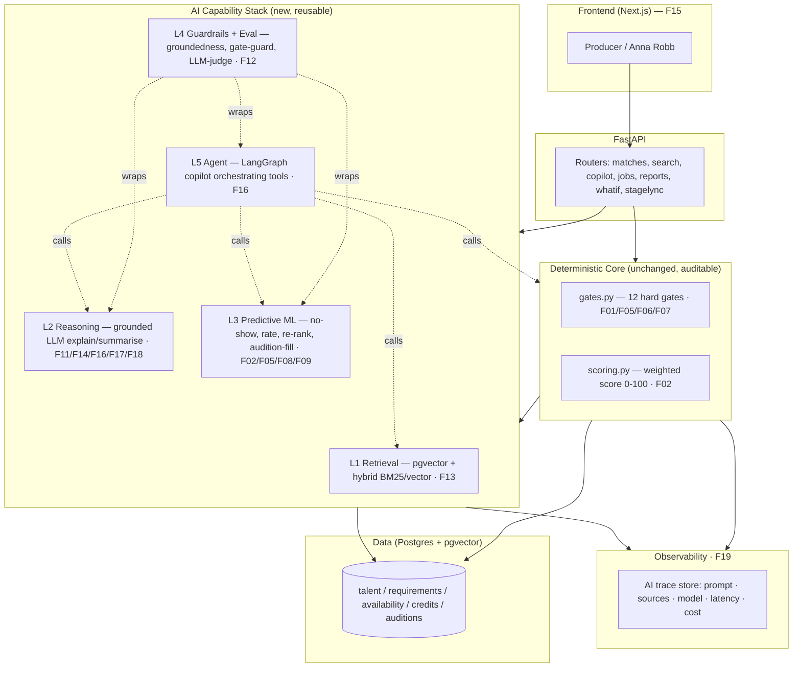

# OLC Talent Matching — AI-Augmented Architecture Blueprint

**Author:** Claude – OLC Talent Copilot Architect (for Pranay Mathur, AI/ML Lead, MobCoder AI)
**Client:** Anna Robb — Executive Producer, OLC / CEO, StageLync
**Version:** 1.0 · **Scope:** Convert the current POC into a robustly AI-driven, production-grade Talent Matching Copilot across **F01–F20**.

---

## 0. TL;DR — the governing principle

> **"Fully AI" ≠ "LLM decides everything."**
> The correct target is **AI-Augmented Hybrid**: a **deterministic, auditable core** for hard constraints and reproducible scoring, with **robust AI layered on top of every feature** for reasoning, ranking, extraction, prediction, and natural language.

This keeps the system aligned to the **Sovereign-AI mindset — deterministic, observable, safe, compliant** — while still making *every* feature genuinely AI-powered. An LLM must never be the thing that decides whether a performer has a valid visa, a diving certificate, or is available on a rehearsal date. Those stay as code. AI reasons *around* those facts.

**Three non-negotiables**

1. **Hard gates stay deterministic** (F01, F05, F06, F07) — safety & compliance.
2. **Base score stays reproducible** against `match_ground_truth.csv` — AI *re-ranks and explains*, it does not silently overwrite the audited number.
3. **Every AI output is grounded** on real dataset facts and **logged** (prompt + sources + model) for the audit trail (F19).

---

## 1. Current AI footprint (baseline)

| Already AI (OpenAI) | Currently pure rule-based / deterministic |
|---|---|
| F13 NL search — embeddings + cosine | F01 hard gates, F02 weighted scoring, F03 top-K, F04 multi-role |
| F16 copilot — RAG grounded on match run + FAQ | F05 availability, F06 safety, F07 mobility, F08 budget |
| Job-brief parse — LLM extract (+ offline regex fallback) | F09 audition thresholding, F10 credit reliability |
| Marketing draft — LLM generation | F11 rejection reasons (**templated strings, not AI**) |
| StageLync discover — embeddings | F12 edge cases, F14 reports, F15 viz, F17 what-if, F18 pool, F19 audit, F20 export |

**Data available to power AI** (grounded in `data_dictionary.csv`):

- `talent_profiles.csv` — 500 talents (skills, rates, ratings, reliability signals)
- `production_requirements.csv` — 120 requirements
- `talent_availability.csv` — 120,000 daily availability rows
- `production_credits.csv` — 1,500 credits incl. **free-text `director_feedback`**, `early_termination_party/reason`, `rehire_eligible`, `contract_value_usd`
- `audition_evaluations.csv` — 3,350 auditions incl. **free-text `panel_notes`** + sub-scores
- `match_ground_truth.csv` — 6,000 labelled matches (`final_match_score`, `ground_truth_label`, `recommended`, `recommendation_rank`) → **training + eval labels**
- `edge_case_manifest.csv` — 20 deterministic edge scenarios → **regression suite**

That free-text + labelled-outcome data is the fuel for the predictive-ML layer below — this is the real moat, not just LLM prompting.

---

## 2. Target architecture



**Key idea:** features don't each get their own bespoke AI — they all call **five shared layers** (L1–L5). Build the layers once; wire every feature into them.

---

## 3. The 5-layer AI capability stack

| Layer | What it is | Tech | Powers |
|---|---|---|---|
| **L1 Retrieval** | Semantic + keyword hybrid search, query understanding | pgvector, BM25, `text-embedding-3-small`, RRF fusion | F13, F04, F16, StageLync |
| **L2 Reasoning (LLM)** | Grounded generation: explanations, narratives, summaries — **facts-only prompting** | `gpt-4o-mini` (+ escalate to a stronger model for reports) | F11, F14, F16, F17, F18 |
| **L3 Predictive ML** | Trained models on historical CSVs | scikit-learn / LightGBM; sentence-transformers for text features | F02 re-rank, F05 no-show, F08 rate, F09 audition-fill, F10 sentiment |
| **L4 Guardrails + Eval** | Deterministic gate-guard, groundedness check, LLM-as-judge, regression harness | Pydantic validators, rules, eval scripts on `match_ground_truth` + `edge_case_manifest` | F01 safety, F11 anti-hallucination, F12 |
| **L5 Agent orchestration** | Multi-step copilot that calls matcher / search / whatif / reports as tools | LangGraph, tool-calling | F16, cross-feature workflows |

Proposed new modules (fits existing `app/` layout):

```
backend/app/
  ai/
    __init__.py
    retrieval.py        # L1 hybrid search
    explain.py          # L2 grounded explanations (F11)
    narrate.py          # L2 report/pool narratives (F14/F18)
    rerank.py           # L3 LLM/ML re-ranker (F02/F03)
    guardrails.py       # L4 groundedness + gate-guard
    agent.py            # L5 LangGraph copilot (F16)
    predictors/
      no_show.py        # F05  (LightGBM classifier)
      rate.py           # F08  (regression)
      audition_fill.py  # F09  (regression/imputation)
      sentiment.py      # F10  (director_feedback / panel_notes)
      train.py          # offline training entrypoint
  engine/               # UNCHANGED deterministic core (gates, scoring, matcher)
```

---

## 4. Feature-by-feature AI design (F01–F20)

Legend — **Keep deterministic?** ✅ core stays rules · ◑ hybrid · — n/a

| F | Feature | AI upgrade (what changes) | Layer / technique | Grounded on (real fields) | Det? |
|---|---|---|---|---|---|
| F01 | Hard gates | AI **around** gates: LLM triages *ambiguous* cases (e.g. free-text `special_instructions`) and flags for review; never overrides a gate | L4 guard + L2 | `required_safety_certifications`, `work_authorized_countries`, `passport_valid_until` | ✅ |
| F02 | Weighted scoring | Keep audited base score; add **LLM/ML re-ranker** on eligible top-K + optional **learned weights** validated vs ground truth | L3 rerank | `final_match_score`, `ground_truth_label`, `recommendation_rank` | ◑ |
| F03 | Top-K ranking | Re-ranker produces final order **with a one-line reason per rank** | L3 + L2 | `recommended`, `positive_match_reasons` | ◑ |
| F04 | Multi-role / secondary | Embedding **skill-adjacency** so `secondary_skills` near-matches count (e.g. "Aerial Silks" ≈ "Aerial Hoop") | L1 | `primary_skills`, `secondary_skills`, `secondary_roles` | ◑ |
| F05 | Availability window | Deterministic overlap **+ ML no-show / drop-out risk** | L3 classifier | `cancellation_rate`, `rehearsal_attendance_rate`, `early_termination_party`, `early_termination_reason`, `rehire_eligible`, `advance_notice_days`, `response_time_hours` | ✅ overlap |
| F06 | Safety & medical | AI **only** parses/verifies cert docs into structured facts; gate stays rules | L2 extraction | `professional_certifications`, `safety_training_level`, `medical_clearance_status`, `safety_incident_rate` | ✅ |
| F07 | Mobility / visa | LLM extracts travel/visa constraints from briefs; feasibility **narrative** | L2 | `work_authorized_countries`, `visa_sponsorship_available`, `travel_ready`, `passport_valid_until` | ✅ |
| F08 | Budget | Deterministic compare **+ rate prediction / fair-range** suggestion | L3 regression | `weekly_contract_rate_usd`, `contract_value_usd`, `experience_years`, `physical_skill_level`, `average_director_rating` | ✅ compare |
| F09 | Audition & showreel | **Predict/impute** missing audition score from sub-scores; text signal from notes | L3 | `technical_score`, `artistic_score`, `response_to_direction_score`, `safety_awareness_score`, `panel_score`, `panel_notes` | ◑ |
| F10 | Credit reliability | **Sentiment / theme extraction** from director feedback → reliability signal | L3 NLP | `director_feedback`, `director_rating`, `incident_recorded`, `rehire_rate` | ◑ |
| F11 | Rejection / risk explain | Replace templated strings with **grounded LLM explanations** (facts-only, no invented reasons) | L2 + L4 | `rejection_reason`, `risk_factors`, gate details | ◑ prose |
| F12 | Edge cases | LLM **auto-generates** new adversarial cases; regression asserts behaviour | L4 test-gen | `edge_case_name`, `expected_system_behaviour` | ✅ asserts |
| F13 | NL search | **Hybrid** (BM25 + vector) + RRF + LLM parses filters from query | L1 | `talent_document()` blob + metadata | — |
| F14 | Reports | Auto-written **executive narrative** over the KPI numbers | L2 narrate | report payload (numbers stay computed) | ◑ numbers |
| F15 | Visualization | **Natural-language → chart** ("show aerial gaps in UAE") | L2 + L5 | aggregates | — |
| F16 | Copilot | Upgrade to **agentic** (LangGraph): calls match, whatif, report, search as tools; multi-turn memory | L5 | all | ◑ tools |
| F17 | What-if | LLM **suggests** high-impact scenarios ("enable visa → +N eligible") then sim runs deterministically | L2 + sim | `visa_sponsorship_available`, budget, dates | ✅ sim |
| F18 | Pool analytics | **Insight narrative** + supply/demand gaps + hiring recommendation | L2 | aggregates over pool | ◑ stats |
| F19 | Observability | Trace **every** AI call (prompt, retrieved sources, model, tokens, latency, cost) into audit trail | L4/OBS | `AuditEvent` extended | ✅ |
| F20 | Export / API | Event-driven triggers + webhook out (ties to the automation-workflow track) | — | — | — |

---

## 5. Predictive-ML layer in detail (the moat)

These are **actual trained models**, not prompts — trained offline on the CSVs, served in-process.

| Model | Target | Features (real columns) | Label source | Model |
|---|---|---|---|---|
| **No-show / drop-out risk** (F05) | P(cancel or early-terminate) | `cancellation_rate`, `rehearsal_attendance_rate`, `advance_notice_days`, `response_time_hours`, `rehire_rate` | `early_termination_party`, `incident_recorded` in credits | LightGBM binary |
| **Rate prediction / fair-range** (F08) | Expected `weekly_contract_rate_usd` | `experience_years`, `physical_skill_level`, `average_director_rating`, `completed_productions`, `country`/region, role | actual rates | Gradient-boosted regressor |
| **Booking-success re-rank** (F02/F03) | P(recommended / strong-positive) | base sub-scores + predicted risk + rate fit | `recommended`, `ground_truth_label` | LightGBM ranker |
| **Audition-score imputation** (F09) | `panel_score` when missing | `technical_score`, `artistic_score`, `response_to_direction_score`, `safety_awareness_score` | observed `panel_score` | Regressor |
| **Director-feedback sentiment** (F10) | reliability sentiment 0–1 + themes | `director_feedback`, `panel_notes` (text) | `director_rating` as weak label | sentence-transformer + logistic head |

**Guardrail:** predictions are **advisory signals surfaced to the producer** — they can influence the re-ranked order and risk badges, but they **never flip a hard gate** and the deterministic `final_match_score` remains visible alongside.

---

## 6. Guardrails & evaluation (L4) — how we stay safe

1. **Gate-guard:** after any AI step that produces a recommendation, re-assert the deterministic gates. If AI ranked an ineligible talent, drop it — code wins.
2. **Groundedness check (F11):** every explanation is validated that each claimed fact exists in the match/gate payload. Ungrounded sentences are stripped or the answer is regenerated.
3. **LLM-as-judge + golden set:** score explanations/copilot answers for faithfulness against `match_ground_truth.csv`.
4. **Regression harness (F12):** run all 20 `edge_case_manifest` scenarios on every change; assert `observed_match_category` / `rejection_reason` unchanged. Add LLM-generated adversarial cases over time.
5. **Determinism lock:** scoring/gates unit tests must keep reproducing `match_ground_truth.csv` exactly (already the design intent of `scoring.py`).

---

## 7. Observability (F19) — AI trace

Extend the existing `AuditEvent` model with AI-specific `event_type`s so nothing is a black box:

```
event_type: ai_retrieval | ai_explanation | ai_rerank | ai_prediction | ai_agent_step
detail: {
  model, prompt_hash, retrieved_sources: [...], input_ids, output_summary,
  tokens_in, tokens_out, latency_ms, cost_usd, grounded: true/false
}
```

Every AI decision becomes replayable and cost-attributable — the same audit spine that already logs `match_started` / `rejected` / `booking_created`.

---

## 8. Phased roadmap

| Phase | Goal | Deliverables | Needs training? |
|---|---|---|---|
| **Phase 1 — LLM value, fast** | Make explanations & search feel "expert" | F11 grounded explanations · F13 hybrid search · F16 agentic copilot skeleton | ❌ |
| **Phase 2 — the moat** | Predictive intelligence | No-show risk (F05) · rate prediction (F08) · booking-success re-ranker (F02/F03) | ✅ offline on CSVs |
| **Phase 3 — robustness** | Trust & scale | Guardrail + eval harness · F12 auto edge-cases · F19 AI tracing · pgvector on Postgres | partial |

Rationale: Phase 1 is pure prompting (ship in days, high perceived value for Anna's demo). Phase 2 builds defensible ML on the labelled data. Phase 3 hardens it for real bookings.

---

## 9. Phase-1 copy-paste starter code

> Drop into `backend/app/ai/`. Uses the same OpenAI-only stack and SQLAlchemy session already in the repo. Deterministic gate facts come from `evaluate_gates()` / `compute_score()` — the LLM only *phrases* them.

### 9.1 `ai/explain.py` — grounded rejection & recommendation explanations (F11)

```python
"""L2 grounded explanations. The LLM is given ONLY verified facts from the
deterministic engine and is forbidden from inventing new reasons (F11 + L4)."""
from __future__ import annotations

import json
import httpx
from ..config import get_settings
from ..embeddings import require_api_key, OpenAIConfigError

settings = get_settings()

_SYSTEM = (
    "You explain a talent-matching decision for a live-production producer. "
    "You are given VERIFIED FACTS as JSON. Rules: "
    "(1) Use ONLY facts present in the JSON — never invent skills, dates, certs, or scores. "
    "(2) If eligible, explain why in 2-3 sentences citing the strongest positive_match_reasons. "
    "(3) If not eligible, state the exact failing gate(s) from rejection_reason in plain English. "
    "(4) Mention risk_factors if present. Be concise, warm, non-technical. No markdown."
)


def _fallback(facts: dict) -> str:
    """Deterministic template if no API key — never leave the user without an answer."""
    if not facts.get("eligible"):
        return f"Not eligible: {facts.get('rejection_reason') or 'a mandatory requirement was not met'}."
    reasons = "; ".join(facts.get("positive_match_reasons") or []) or "meets all mandatory requirements"
    risk = facts.get("risk_factors")
    tail = f" Watch-outs: {risk}." if risk else ""
    return f"Recommended ({facts.get('match_category')}, score {facts.get('final_match_score')}): {reasons}.{tail}"


def explain_match(facts: dict) -> str:
    """facts = one candidate row from serialize_run() (already gate-derived)."""
    try:
        api_key = require_api_key()
    except OpenAIConfigError:
        return _fallback(facts)

    try:
        resp = httpx.post(
            "https://api.openai.com/v1/chat/completions",
            headers={"Authorization": f"Bearer {api_key}"},
            json={
                "model": settings.openai_chat_model,
                "temperature": 0.2,
                "messages": [
                    {"role": "system", "content": _SYSTEM},
                    {"role": "user", "content": json.dumps(facts, default=str)[:6000]},
                ],
            },
            timeout=45.0,
        )
        resp.raise_for_status()
        text = resp.json()["choices"][0]["message"]["content"].strip()
        return text or _fallback(facts)
    except Exception:
        return _fallback(facts)  # graceful degradation
```

Groundedness guard to run before returning (L4):

```python
# ai/guardrails.py
def is_grounded(explanation: str, facts: dict) -> bool:
    """Cheap check: any number the LLM cites must exist in the facts payload."""
    import re
    nums_in_text = set(re.findall(r"\d+(?:\.\d+)?", explanation))
    allowed = set(re.findall(r"\d+(?:\.\d+)?", str(facts)))
    return nums_in_text.issubset(allowed) if nums_in_text else True
```

### 9.2 `ai/retrieval.py` — hybrid search (BM25 + vector, RRF fusion) (F13)

```python
"""L1 hybrid retrieval: combine keyword (BM25) and semantic (embedding) ranks
via Reciprocal Rank Fusion. More robust than pure cosine on names, skills,
and rare terms (e.g. 'pyrotechnics')."""
from __future__ import annotations

import re
from collections import defaultdict
from ..embeddings import embed_text, cosine_similarity, OpenAIConfigError


def _bm25_lite(query: str, docs: list[tuple[str, str]]) -> list[str]:
    """Tiny BM25-ish keyword scorer. docs = [(id, text)]. Returns ids best-first."""
    q = [t for t in re.findall(r"[a-z]{3,}", query.lower())]
    scores: dict[str, float] = defaultdict(float)
    for _id, text in docs:
        blob = text.lower()
        scores[_id] = sum(blob.count(t) for t in q) / (1 + len(blob) / 500)
    return [i for i, _ in sorted(scores.items(), key=lambda x: -x[1])]


def _vector_rank(query: str, docs: list[tuple[str, str]]) -> list[str]:
    qv = embed_text(query)
    sims = []
    for _id, text in docs:
        try:
            sims.append((_id, cosine_similarity(qv, embed_text(text[:2000]))))
        except Exception:
            continue
    return [i for i, _ in sorted(sims, key=lambda x: -x[1])]


def hybrid_search(query: str, docs: list[tuple[str, str]], k: int = 10, kk: int = 60) -> list[str]:
    """Reciprocal Rank Fusion of keyword + vector rankings."""
    kw = _bm25_lite(query, docs)
    try:
        vec = _vector_rank(query, docs)
    except OpenAIConfigError:
        return kw[:k]  # keyword-only fallback
    rrf: dict[str, float] = defaultdict(float)
    for rank, _id in enumerate(kw):
        rrf[_id] += 1.0 / (kk + rank)
    for rank, _id in enumerate(vec):
        rrf[_id] += 1.0 / (kk + rank)
    return [i for i, _ in sorted(rrf.items(), key=lambda x: -x[1])][:k]
```

### 9.3 `ai/rerank.py` — re-rank eligible top-K with reasons (F02/F03)

```python
"""L3 re-ranker (LLM variant for Phase 1; swap for LightGBM ranker in Phase 2).
Operates ONLY on already-eligible candidates so it can never surface someone
the deterministic gates rejected (L4 gate-guard preserved)."""
from __future__ import annotations

import json
import httpx
from ..config import get_settings
from ..embeddings import require_api_key, OpenAIConfigError

settings = get_settings()


def rerank_topk(requirement: dict, eligible: list[dict], top_n: int = 5) -> list[dict]:
    """eligible = candidates that already passed gates, each with sub-scores.
    Returns re-ordered list with an added 'ai_reason' — base score is preserved."""
    if not eligible:
        return []
    try:
        api_key = require_api_key()
    except OpenAIConfigError:
        return sorted(eligible, key=lambda c: -c["final_match_score"])[:top_n]

    payload = {
        "requirement": {k: requirement.get(k) for k in
                        ("required_primary_role", "mandatory_skills", "production_type",
                         "urgency_level", "production_risk_level")},
        "candidates": [{k: c.get(k) for k in
                        ("talent_id", "final_match_score", "skill_score", "availability_score",
                         "reliability_score", "safety_compliance_score", "risk_factors")}
                       for c in eligible[:12]],
    }
    system = (
        "Re-rank ONLY the given eligible candidates for this production. "
        "Prioritise mandatory-skill fit, reliability, and safety for high-risk shows. "
        "Return JSON: {\"order\":[talent_id...], \"reasons\":{talent_id: one_line}}. "
        "Do not add or remove candidates."
    )
    try:
        resp = httpx.post(
            "https://api.openai.com/v1/chat/completions",
            headers={"Authorization": f"Bearer {api_key}"},
            json={"model": settings.openai_chat_model, "temperature": 0.1,
                  "response_format": {"type": "json_object"},
                  "messages": [{"role": "system", "content": system},
                               {"role": "user", "content": json.dumps(payload, default=str)}]},
            timeout=45.0,
        )
        resp.raise_for_status()
        out = json.loads(resp.json()["choices"][0]["message"]["content"])
        order, reasons = out.get("order", []), out.get("reasons", {})
        by_id = {c["talent_id"]: c for c in eligible}
        ranked = [dict(by_id[t], ai_reason=reasons.get(t, "")) for t in order if t in by_id]
        # gate-guard: anyone dropped by the LLM falls back to score order at the end
        seen = {c["talent_id"] for c in ranked}
        ranked += sorted((c for c in eligible if c["talent_id"] not in seen),
                         key=lambda c: -c["final_match_score"])
        return ranked[:top_n]
    except Exception:
        return sorted(eligible, key=lambda c: -c["final_match_score"])[:top_n]
```

**Wire-in (example, `routers/matches.py`):** after building the eligible list, call `rerank_topk(req_dict, eligible)` for the shortlist and `explain_match(candidate)` per card. Nothing in `gates.py` / `scoring.py` changes — you're decorating, not replacing.

---

## 10. What to build next

1. **Phase 1, week 1:** `ai/explain.py` + groundedness guard → replace F11 templated strings; add `ai/retrieval.py` behind F13.
2. **Phase 1, week 2:** `ai/rerank.py` into the shortlist; agentic F16 skeleton (LangGraph) exposing `run_match`, `search_talent`, `what_if`, `generate_report` as tools.
3. **Phase 2:** `ai/predictors/train.py` → train no-show + rate models on the CSVs; surface risk badges (F05) and fair-rate (F08); swap LLM re-ranker for the LightGBM ranker.
4. **Phase 3:** eval harness on `match_ground_truth` + `edge_case_manifest`; extend `AuditEvent` for AI tracing; migrate to Postgres + pgvector (`docker-compose.yml` already provisions it).

---

*Determinism where it must be. Intelligence where it helps. Every AI output grounded and logged.*
